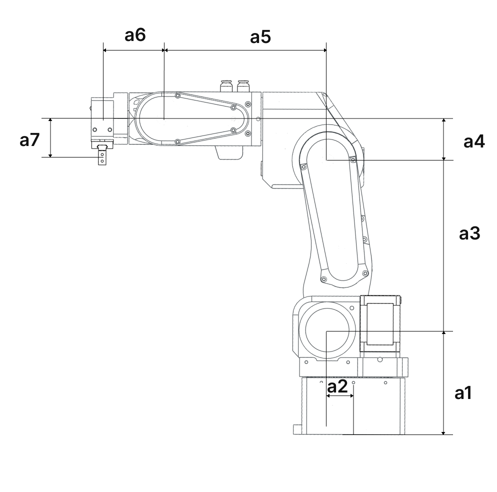
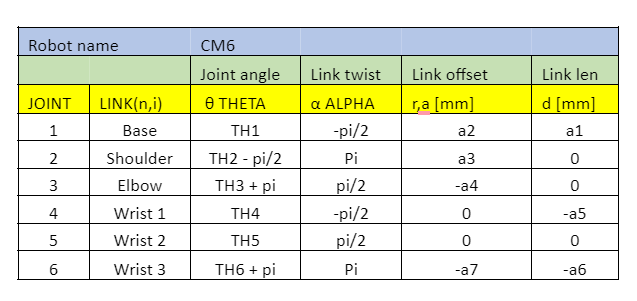
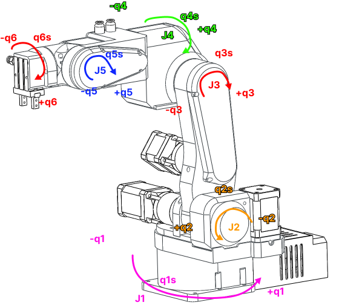

 
# Robot Specifications

---

## Specs

| Parameter | Value |
| --- | --- |
| Payload | 1 kg near the base, 0.5 kg across the full workspace |
| Weight | 5.5 kg |
| Reach | 400 mm with the standard gripper |
| Degrees of freedom | 6 rotating joints |
| Material | 3D-printed PETG plastic |
| Power consumption | 40 W |
| Repeatability | 0.1 mm |
| Motors | Stepper motors |
| Gearboxes | Precision planetary and belt |
| Position sensing | Limit switches (open-loop version) |
| Drivers | Open-loop stepper drivers (open-loop version) |
| Isolated outputs | 2 |
| Active CAN buses | 1 |
| PC communication | USB |
| Pneumatic connectors | 2 |

### Rotation range

| Joint | Range |
| --- | --- |
| Joint 1 | 250° |
| Joint 2 | 141° |
| Joint 3 | 180° |
| Joint 4 | 212° |
| Joint 5 | 180° |
| Joint 6 | ∞ |

---

## Operating temperatures

Stepper motors can operate at up to 100–110 °C without issues. For PAROL6 this is not acceptable, since the robot is built from plastic. PETG is recommended because of its high glass transition temperature.

| Joint | Holding position (5 h) | Moving (2 h) |
| --- | --- | --- |
| Joint 1 | 51 °C | 64 °C |
| Joint 2 | 54 °C | 64 °C |
| Joint 3 | 48 °C | 52 °C |
| Joint 4 | 60 °C | 73 °C |
| Joint 5 | 60 °C | 72 °C |
| Joint 6 | 61 °C | 65 °C |

Currents can be adjusted in the PAROL6 control board. The values to adjust are located in `constants.h`. `MOTORx_MAX_CURRENT` sets the maximum stepper current. In `motor_init.cpp` you can adjust `Joint__->hold_multiplier` where `Hold_current = MAX_current * hold_multiplier`. Reducing currents will lower motor torque and in turn reduce maximum speeds and accelerations.

!!! danger

    When using the robot for longer periods, you **must reduce the current** in the software or you risk destroying your robot.

---

## Dimensions

Dimensions using the default pneumatic gripper.

| Dimension | Value |
| --- | --- |
| a1 | 110.50 mm |
| a2 | 23.42 mm |
| a3 | 180.00 mm |
| a4 | 43.50 mm |
| a5 | 176.35 mm |
| a6 | 62.8 mm |
| a7 | 45.25 mm |

---

## Kinematic diagram

!!! note "Dimensions can change!"

    For example, when you change grippers or place the robot on an additional base, you need to update your parameters in the DH table — otherwise your kinematic diagram will be incorrect.

- Kinematic diagram for the robot using the standard pneumatic gripper

---

## Denavit-Hartenberg parameters

!!! warning "Standby position"

    This is the robot position defined by the DH table below. This position is also called the **standby position**. In this position, joint angles are as follows:

    - Joint 1 → 0°
    - Joint 2 → -90°
    - Joint 3 → 180°
    - Joint 4 → 0°
    - Joint 5 → 0°
    - Joint 6 → 180°

---

## Joint reduction ratios and microstepping

Reduction ratios for each joint are as follows:

| Joint | Type | Ratio |
| --- | --- | --- |
| Joint 1 | Belt | 6.4 : 1 |
| Joint 2 | Planetary gearbox | 20 : 1 |
| Joint 3 | Planetary gearbox × Belt (38:42) | 18.0952381 : 1 |
| Joint 4 | Belt | 4 : 1 |
| Joint 5 | Belt | 4 : 1 |
| Joint 6 | Planetary gearbox | 10 : 1 |

PAROL6 uses stepper motors with microstepping set to 32 on all motors. With 32 microstepping, a standard 200-step-per-revolution stepper motor requires 6400 steps for one full revolution.

Smallest theoretical step sizes at joint level with 32 microstepping (values are after reduction ratios):

| Joint | Step size (rad) | Step size (deg) |
| --- | --- | --- |
| Joint 1 | 0.00015339807878856412 | 0.0087890625 |
| Joint 2 | 4.9087385212340514e-05 | 0.0028125 |
| Joint 3 | 5.4254478392586896e-05 | 0.0031085526315789477 |
| Joint 4 | 0.0002454369260617026 | 0.0140625 |
| Joint 5 | 0.0002454369260617026 | 0.0140625 |
| Joint 6 | 9.817477042468103e-05 | 0.005625 |

---

## Joint limits

!!! tip

    Joint limits can change depending on the type of gripper or base. When using the robot, make sure you use the correct joint limits for your application.

Robot joint positive rotations are in the directions shown in the image below.

!!! note

    Values are in degrees.

| Joint      | Limit in negative direction        | Standby position| Limit in positive direction |
| ----------- | ------------------------------------ | -- | ------------------------------------ |
| J1       | -123.046875 | 0 | 123.046875 |
| J2       | 145.0088 | -90 | -3.375 |
| J3    | 107.866     | 180 | 287.8675 |
| J4       | -105.46975 | 0 | 105.46975|
| J5       | -90 | 0 |90 |
| J6    | 0 | 180 | 360 |