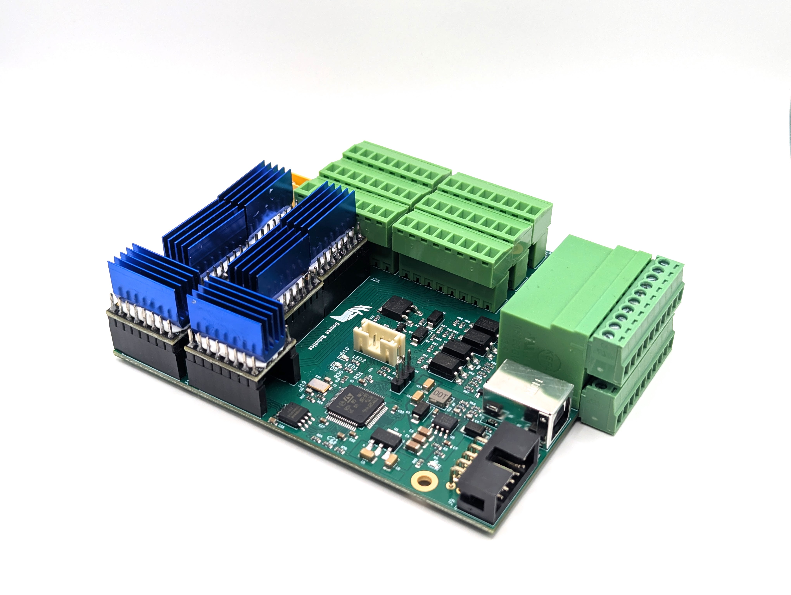
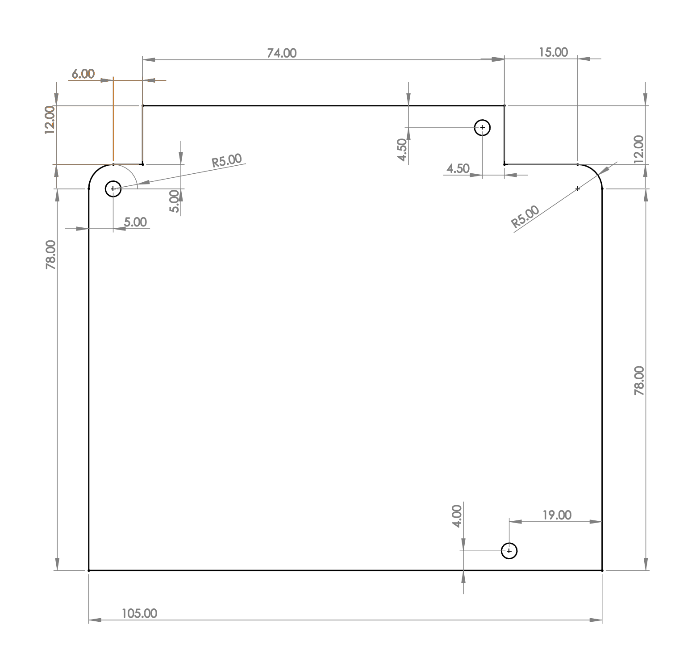
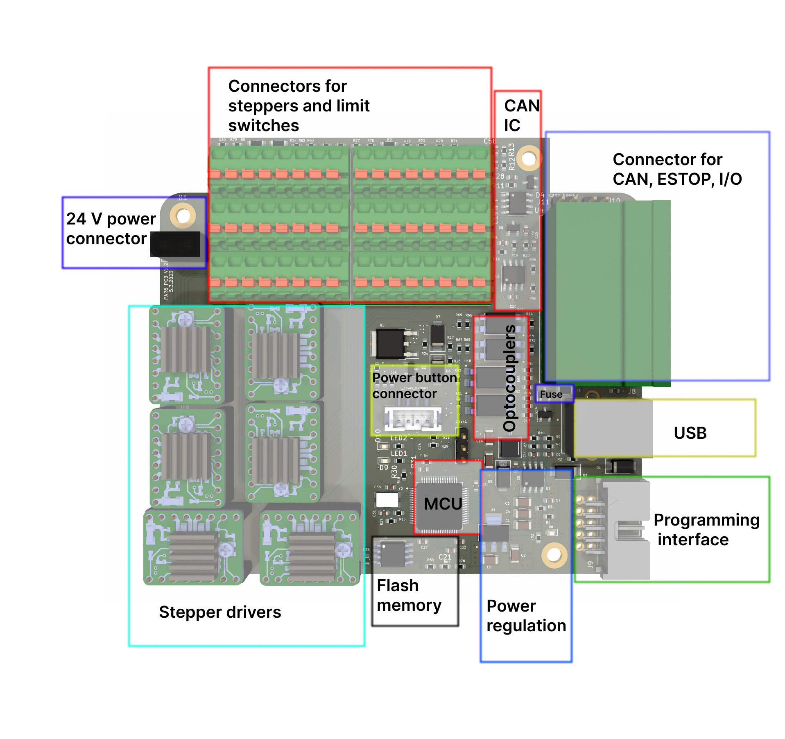
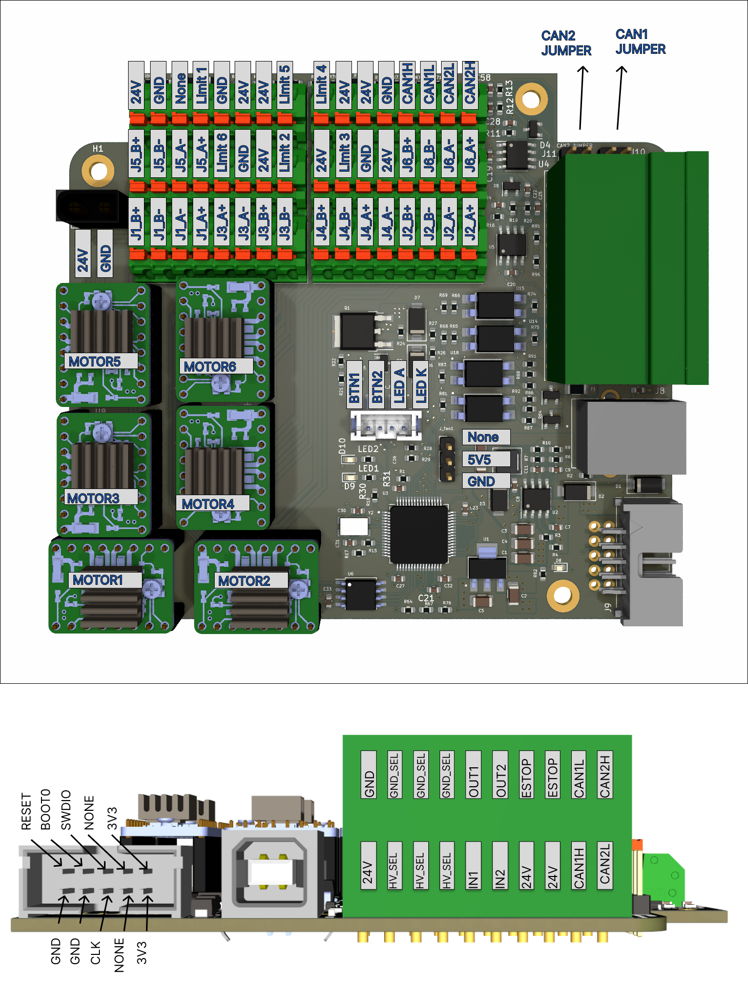
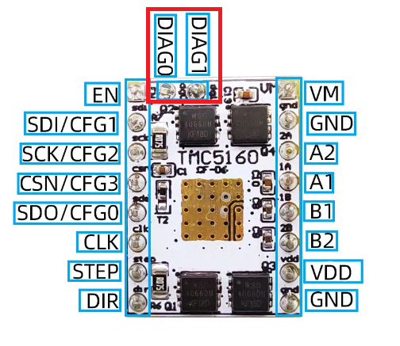
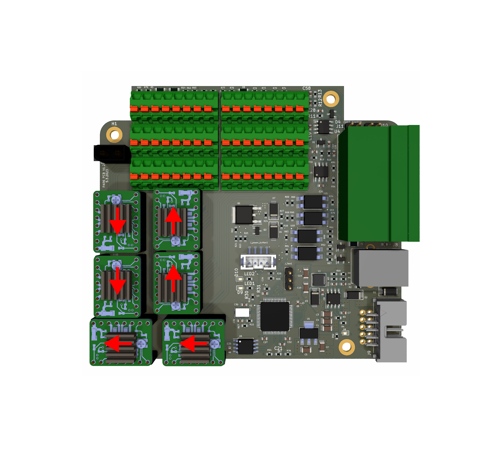
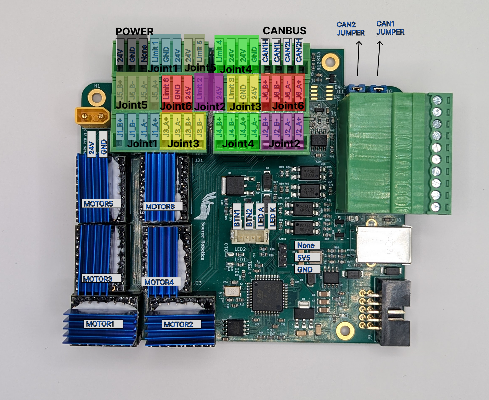
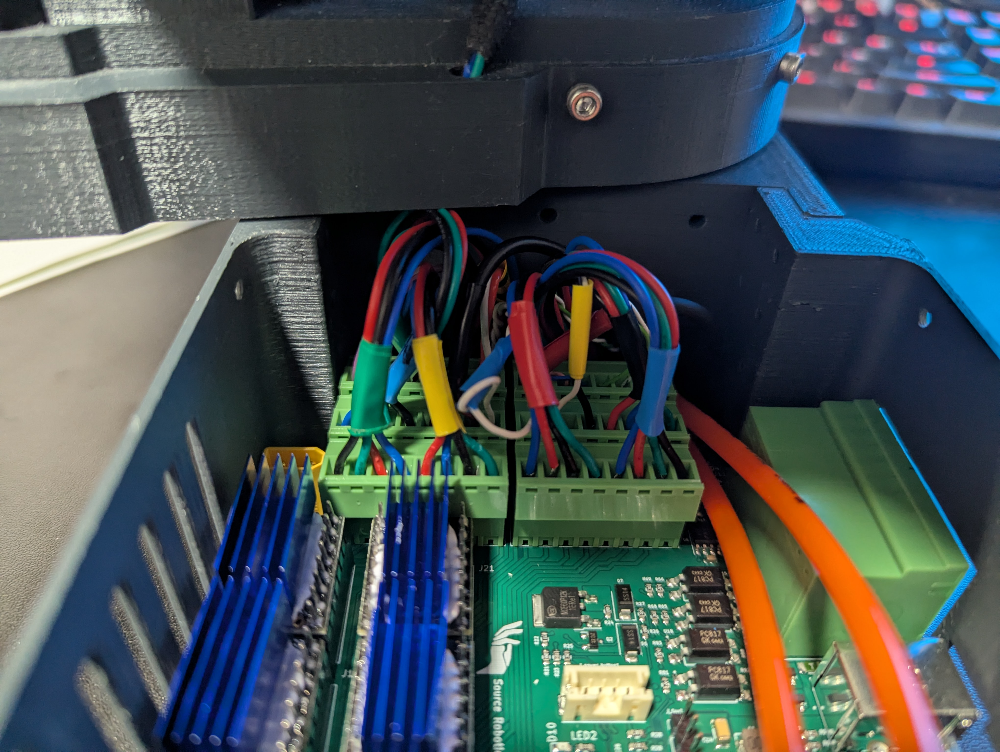
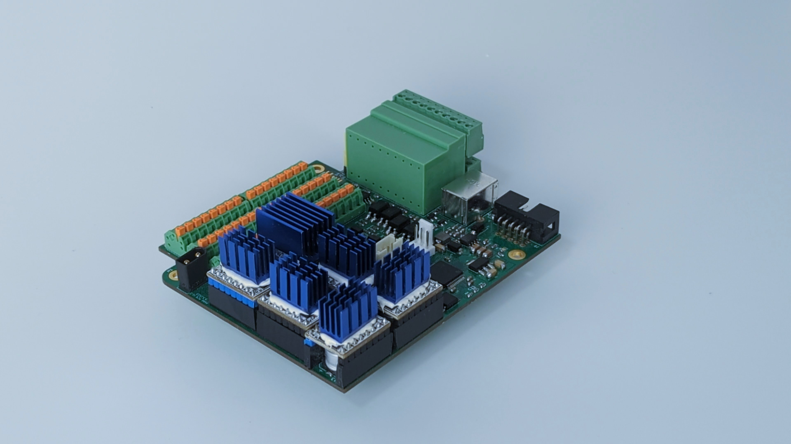

# PAROL6 Control Board

---

<p align="center">

</p>

---

!!! success "Board testing"

    Every PAROL6 control board is **end-to-end tested** by Source Robotics before shipping. Your board ships fully functional with test software preloaded.

!!! danger "Stepper driver installation"

    When installing stepper drivers, you **must** pay close attention to the orientation. **Installing a stepper driver in the wrong direction will permanently destroy your PAROL6 control board.**

---

## Introduction

The PAROL6 control board is the advanced 32-bit controller for 6 AXES robotic arms like PAROL6. It works out of the box with PAROL6 and PAROL6 commander software.

To use PAROL6 robotic arm with PAROL6 commander software you will need a PAROL6 control board. The PAROL6 control board is a compact robotic controller. It is by size a little bigger than a pack of playing cards. It allows PAROL6 to be a really small and portable robot without the need for a control cabinet that is usually the size of the whole robot.

!!! note

    There are two functionally identical versions of the PAROL6 control board. The version with orange spring-loaded contacts is no longer being produced. The version with a pluggable system terminal block is now in production and available in our store.

<p align="center">

</p>

---

## Features

<p align="center">

</p>

---

### Hardware specs

| Parameter | Value |
| --- | --- |
| Processor | STM32F446RE |
| Processor features | Arm Cortex-M4 with DSP and FPU, 512 KB Flash, 180 MHz CPU, ART Accelerator |
| Communication interfaces | 2× CAN bus (CAN2 transceiver not soldered), 1× USB |
| Stepper drivers | TMC5160 |
| Stepper driver features | SPI comms, 10–35 V, 3 A max, protection features |
| Inputs | 2× isolated |
| Outputs | 2× isolated, 0.5 A current output |
| E-stop input | Dedicated MCU pin for E-stop interrupt, 2 E-stop connections on board |
| Additional memory | W25Q64FV, SPI, 64 Mb |
| Programming interface | JTAG |
| Cooling fan connection | 5 V cooling fan |
| Smart power button connection | — |

---

### Operating limits

| Parameter | Value |
| --- | --- |
| Power supply | 18 V minimum, 24 V maximum |
| Stepper driver rated current | 2.5 A |
| Stepper driver maximum current | 3.6 A (short burst or extreme cooling only) |
| Temperature warning | 100 °C (stepper driver) |
| Temperature error | 120 °C (stepper driver) |
| Isolated input voltage | 24 V nominal, 12 V min, 50 V max |
| Isolated output voltage | 48 V max |
| Isolated output current | 1 A max |
| Fuse | 2 A fuse for outputs used in non-isolated mode |
| Cooling fan current | 0.3 A max |

---

## Physical properties

---

### Dimensions

!!! note

    Dimensions are in millimetres.

<p align="center">

</p>

---

### Mounting

The PAROL6 control board has 3 mounting holes. Use M3 screws to mount the PCB.

---

### Cooling

Stepper drivers require active cooling. Use a Noctua fan or any other 5 V-tolerant fan that fits the robot. For PAROL6, the fan must have the following dimensions: 40×40×20 mm.

Keep the fan current draw around 0.1 A and do not exceed 0.3 A.

!!! warning

    The fan must **not** be a PWM-type fan.

---

## Connections

<p align="center">

</p>

---

### Connectors

| Connection | Connector type |
| --- | --- |
| 24 V power | XT30 male |
| Cooling fan | 3-pin, 2.54 mm pitch |
| Power on/off button | JST B4B-PH-SM4-TB(LF)(SN) |
| USB | USB type B female |
| Programming adapter | 2-row × 5-pin, 2.54 mm pitch |

---

### Pin definitions

!!! tip

    Even though pins are named PUL1–PUL6, this does not mean they control the corresponding joint number. Follow the connection plan below for the actual joint mappings.

Connections:

```c
        #define PUL1 PC6 ---> Controls Joint 1, PULS pin of stepper driver
        #define PUL2 PA10 --> Controls Joint 5, PULS pin of stepper driver
        #define PUL3 PC0 ---> Controls Joint 6, PULS pin of stepper driver
        #define PUL4 PC3 ---> Controls Joint 4, PULS pin of stepper driver
        #define PUL5 PC9 ---> Controls Joint 3, PULS pin of stepper driver
        #define PUL6 PC5 ---> Controls Joint 2, PULS pin of stepper driver

        #define DIR1 PB15 --> Controls Joint 1, DIR pin of stepper driver
        #define DIR2 PA1 ---> Controls Joint 5, DIR pin of stepper driver
        #define DIR3 PC1 ---> Controls Joint 6, DIR pin of stepper driver
        #define DIR4 PA0 ---> Controls Joint 4, DIR pin of stepper driver
        #define DIR5 PA8 ---> Controls Joint 3, DIR pin of stepper driver
        #define DIR6 PB1 ---> Controls Joint 2, DIR pin of stepper driver

        #define LIMIT1 PC12 ---> Connected to Limit 1 on PAROL6 control board
        #define LIMIT2 PB3  ---> Connected to Limit 2 on PAROL6 control board
        #define LIMIT3 PA15 ---> Connected to Limit 3 on PAROL6 control board
        #define LIMIT4 PD2  ---> Connected to Limit 4 on PAROL6 control board
        #define LIMIT5 PB4  ---> Connected to Limit 5 on PAROL6 control board
        #define LIMIT6 PC11 ---> Connected to Limit 6 on PAROL6 control board

        #define SELECT1 PC7  ---> Controls Joint 1, Select pin of stepper driver
        #define SELECT2 PA9  ---> Controls Joint 5, Select pin of stepper driver
        #define SELECT3 PC15 ---> Controls Joint 6, Select pin of stepper driver
        #define SELECT4 PC2  ---> Controls Joint 4, Select pin of stepper driver
        #define SELECT5 PC8  ---> Controls Joint 3, Select pin of stepper driver
        #define SELECT6 PC4  ---> Controls Joint 2, Select pin of stepper driver

        #define GLOBAL_ENABLE PA3  --> Connected to ENABLE pins of all stepper drivers.

        #define MISO PA6    --> SPI MISO; connected to all 6 stepper drivers and flash memory
        #define MOSI PA7    --> SPI MOSI; connected to all 6 stepper drivers and flash memory
        #define SCK PA5     --> SPI SCK; connected to all 6 stepper drivers and flash memory
        #define FLASH_SELECT PA4 --> Chip select pin of the flash memory

        #define LED1 PB2  --> LED1 on PCB
        #define LED2 PB10 --> LED2 on PCB

        #define SUPPLY_ON_OFF PC10 --> Connected to power button connector, turns on/off power fet
        #define SUPPLY_BUTTON_STATE PC14  --> Connected to power button connector, reads state of the button

        #define INPUT1 PB6      --> Connected to IN1 pins on the side of the board
        #define INPUT2 PB5      --> Connected to IN2 pins on the side of the board

        #define OUTPUT1 PC13    --> Connected to OUT2 pins on the side of the board
        #define OUTPUT2 PB7     --> Connected to OUT2 pins on the side of the board

        #define ESTOP PB14 --> Connected to ESTOP pins on the side of the board

        #define VBUS PB0   --> Reads voltage of the power supply voltage

        #define USB_D_PLUS  PA12 --> USB pins
        #define USB_D_MINUS PA11 --> USB pins

        #define CAN1TX PB9      --> CAN channel 1
        #define CAN1RX PB8      --> CAN channel 1

        #define CAN2TX PB13     --> CAN channel 2
        #define CAN2RX PB12     --> CAN channel 2
```

---

### Stepper driver

Use only the stepper drivers listed in the BOM. If you do not purchase them from the Source Robotics website, you will need to make the following modifications:

- Remove the 2 diagnostic (DIAG) pins.
- Apply thermal cement to attach the heatsink (the link to the correct cement is in the BOM).

!!! danger

    Only use the stepper drivers specified in the BOM. Using any other driver will destroy your PAROL6 control board.

!!! warning

    You must secure the heatsink to the stepper driver with thermal cement. Failing to do so will destroy your PAROL6 control board.

---    

### Stepper driver orientation

Stepper drivers must be placed according to the diagram below. The orientation can be identified by the position of the 2 diagnostic (DIAG) pins.

!!! danger

    Installing a stepper driver in the wrong orientation will permanently destroy your PAROL6 control board. Double-check orientation before powering on.

!!! warning

    Some stepper drivers ship with DIAG pins soldered. You **must** remove them before installation. If the DIAG pins remain, they will be blocked by capacitors on the PAROL6 PCB and the module will not seat correctly.

<p align="center">

</p>

!!! note

    If you source a TMC5160 driver from a third party, verify that it follows the pinout shown in the image above.

!!! note

    The DIAG pins must align with the red arrows shown in the image below.

<p align="center">

</p>

---

## How to upload code

The microcontroller on the PAROL6 control board is the STM32F446RE. To upload code, use an ST-Link device connected to the dedicated CLK, SWDIO, 3V3, and GND pins. You can use jumper cables or the [dedicated ST-Link + cable assembly](https://source-robotics.com/products/parol6-programming-adapter).

!!! danger

    Only use one of the two methods described above to program the PAROL6 control board. Connecting an ST-Link with a cable but without the adapter **will permanently destroy your board**.

---

## Wiring PAROL6 control board

Follow this diagram to wire your PAROL6 robotic arm to the PAROL6 control board.

<p align="center">

</p>

After successful wiring, the robot and control board should look something like this.

Connect limit switches to 24 V and signal. Connect inductive sensors to 24 V, GND, and signal.

<p align="center">

</p>

<p align="center">

</p>

---

## Code upload

If you are having problems uploading code via ST-Link, try installing the ST-Link USB drivers: [ST-Link driver download (STSW-LINK009)](https://www.st.com/en/development-tools/stsw-link009.html)

---

## PCB revision history

| Version | Status | Notes |
| --- | --- | --- |
| V2.0 | Current | Pluggable system terminal block connectors |
| V1.2 | Discontinued | Spring-loaded Phoenix contacts; functionally identical to V2.0 |

<p align="center">

</p>

<p align="center">

</p>


