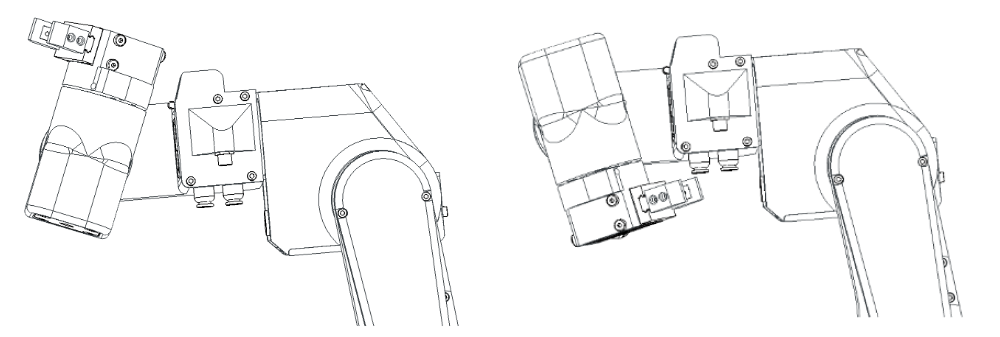
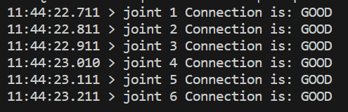
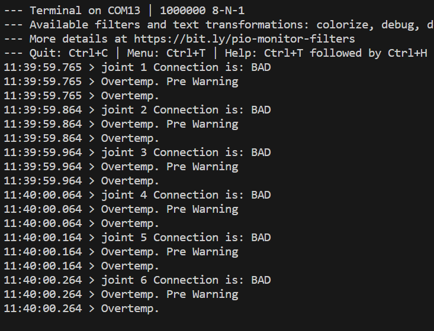
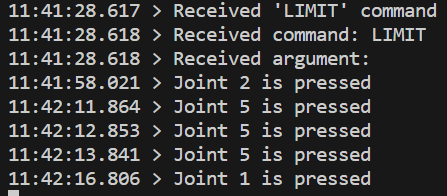
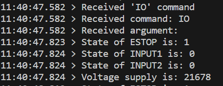
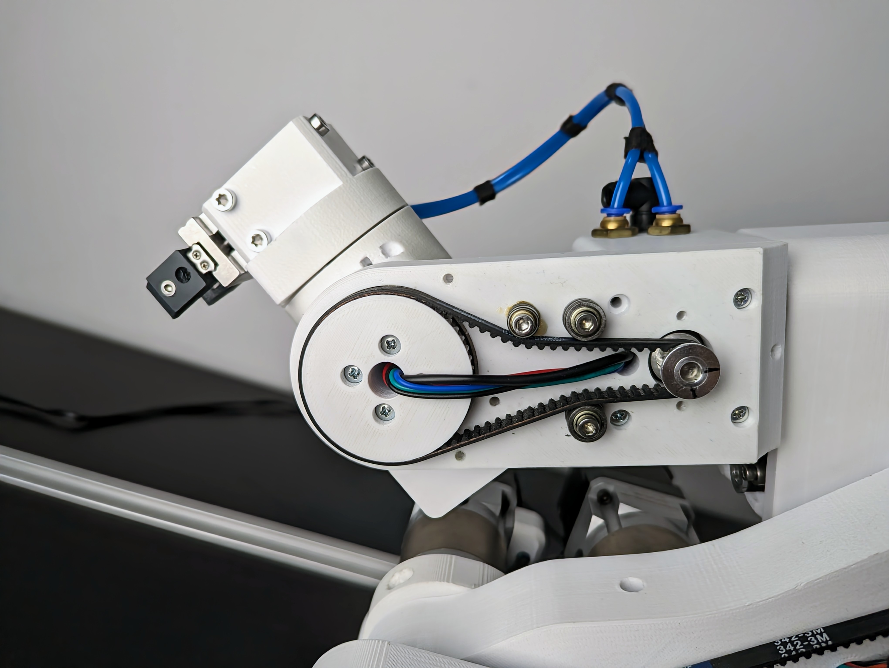
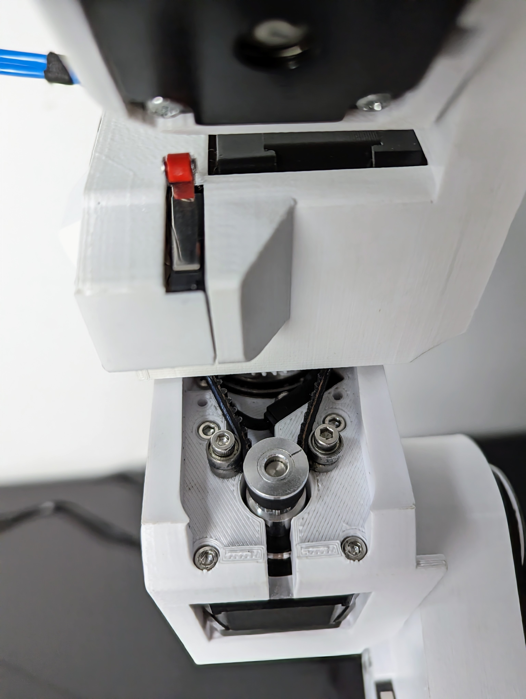
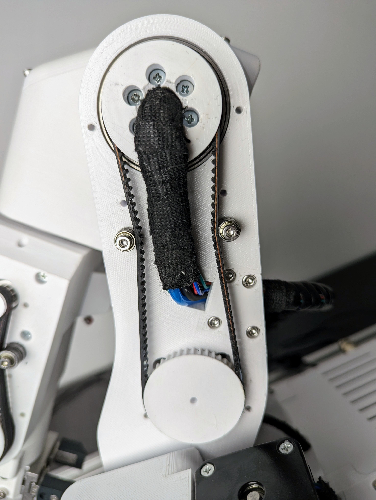
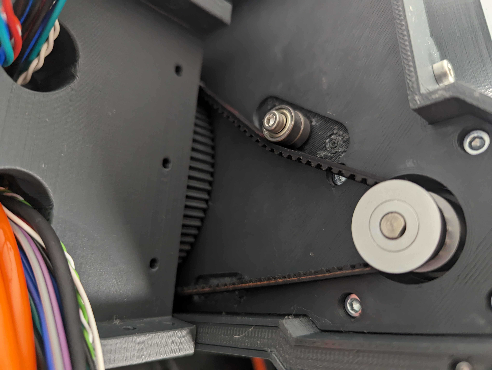

# Getting Started

---

## Assembly manual

The assembly manual is located in the [PAROL6 GitHub repository](https://github.com/PCrnjak/PAROL6-Desktop-robot-arm/tree/main/Building%20instructions).

- If you decide to build or buy a kit, follow the assembly manual to assemble it.
- The assembly manual is also a useful reference for repairing and upgrading your robot. Make sure you use the latest version.

After you have built the robot, follow these steps to get it up and running.

---

## BOM

If you are building the robot yourself, source the parts from the [Bill of Materials (BOM)](https://github.com/PCrnjak/PAROL6-Desktop-robot-arm/tree/main/BOM).

---

## Video guides

You can also follow a [video tutorial playlist](https://www.youtube.com/playlist?list=PLSueoDrBt5MMTL9O8qAWZiJrNIf8-29Qz) to assemble and set up the robot.

---

## How to follow this guide

Read the whole guide first, then go through each step. If you make a mistake, you may need to go back a few steps — it is recommended to read or skim through this page before starting.

---

## Do not do this

There are a few things you should never do to your PAROL6.

!!! warning

    Never spin Joint 5 more than one rotation.

<p align="center">

</p>

The image above shows the range of Joint 5.

!!! warning

    If you don't have blockers on Joint 1, it is possible to spin it more than one rotation. Never do this.

!!! warning

    PAROL6 does not have brakes. When you power off the robot, the stepper motors will stop producing torque and **the robot will fall**. Never turn off the robot without holding it.

---

## SSG48 gripper

If you plan to use the [SSG48 gripper](https://github.com/PCrnjak/SSG-48-adaptive-electric-gripper), first make sure that your PAROL6 works, then attach it to the robot. See the Peripherals section for instructions on how to connect the gripper.

---

## Powering on

<p align="center">

</p>

PAROL6 requires 3 connections for normal operation.

- **Power connection** — marked green in the image
- **USB connection** — marked blue in the image
- **E-stop** — marked with yellow and pink squares (one lead to yellow, one to pink)

If you have uploaded the **main** software to the PAROL6 control board, the on/off operation works as follows:

1. Connect the power cable (marked green).
2. Press the power button (marked red) to turn the robot on or off.
3. After pressing the power button, the robot joints will start producing torque. You will hear 6 clicking sounds — this is normal.
4. The robot is now locked and waiting to receive commands.

!!! warning

    The robot will power on by itself if you have connected the 3.3 V supply from the programming port.

---

## Stepper induced voltage

!!! danger "Do not spin an unpowered robot when connected to a power supply"

    Stepper motors generate voltage when spun, which can power on the robot. After turning off the robot, move it to the standby position slowly. Never spin the robot randomly when it is connected to power — you risk powering it on unintentionally.

---

## Powering off

!!! danger "Do not try to power off the robot while it is running"

    If the robot starts to behave unexpectedly, use the E-stop. If the E-stop is not functional, cut the power supply. Reaching for the power button should be the last option.

Because PAROL6 has no brakes, a sudden loss of power will cause the robot to fall, which may damage the robot or injure the operator.

The robot is powered on and off by pressing the button marked red in the image. Even when USB is not connected, pressing the button will energise the motors. You will hear 6 clicking sounds — this is normal behaviour.

To power off, **grab the robot by the forearm first**, then press the power button. This prevents the robot from falling. **These steps are mandatory.** Failing to follow them may damage your robot.

!!! warning

    You will not be able to power off the robot if there is an external 3.3 V supply connected (e.g., from an ST-Link).

---

## Installing PAROL6 commander software

Commander software is available in the [PAROL Commander GitHub repository](https://github.com/PCrnjak/PAROL-commander-software). Installation instructions are located there.

To install using `requirements.txt`, navigate into the commander software folder and run:

```bash
pip install -r requirements.txt
```

Platform-specific installation guides:

- [Windows installation guide](https://github.com/PCrnjak/PAROL-commander-software/blob/main/Windows_install.md)
- [Linux installation guide](https://github.com/PCrnjak/PAROL-commander-software/blob/main/Linux_install.md)

---

## Uploading PAROL6 control board code

The microcontroller on the PAROL6 control board is the STM32F446RE. To upload code, use an ST-Link device connected to the dedicated CLK, SWDIO, 3V3, and GND pins only — do not connect any other pins. You can use jumper cables or the [dedicated ST-Link + cable assembly](https://source-robotics.com/products/parol6-programming-adapter).

!!! danger

    Only use one of the two methods described above to program the PAROL6 control board. Connecting an ST-Link with a cable but without the adapter **will permanently destroy your board**.

---

## Uploading main control board code

PAROL6 control boards ship fully tested with **test** code preloaded. You can use that code to verify that your robot is correctly connected to the control board. The main control board code is separate from the test code — it enables communication with the commander software.

You will need working commander software to use the main code, or you can build your own API.

Upload the following code: [PAROL6 main control board software](https://github.com/PCrnjak/PAROL6-Desktop-robot-arm/tree/main/PAROL6%20control%20board%20main%20software)

If you are having problems uploading code via ST-Link, try installing the ST-Link USB drivers: [STSW-LINK009](https://www.st.com/en/development-tools/stsw-link009.html)

!!! note "If using the SSG48 gripper"

    In `main.cpp`, change `j5_homing_offset` to `8035`.

---

## PAROL6 control board

!!! warning

    When uploading code with ST-Link, disconnect the 24 V supply from the robot first. After the upload is complete, disconnect the ST-Link and then reconnect the power supply.

See the [PAROL6 control board](page3_1.md) page for more information.

---

## First startup

When first starting the robot with the main code uploaded, the most common problem is that motors turn in the wrong direction. There are 2 ways to fix this:

- Open the robot base and swap the wires of one stepper motor phase.
- **Recommended:** Upload new code to the PAROL6 control board with a small change.

If you choose the code edit approach, edit the following in `motor_init.cpp`:

```cpp
// If a joint rotates in the wrong direction, switch the value between 0 and 1
Joint__->direction_reversed = 1;
```

---

## **Homing**

Homing is a process where a robot joint finds a known position in its rotation space, typically by hitting a limit switch or sensor.

The process for PAROL6 and FAZE4 robots is the same as that for 3D printers. After powering up, the robot doesn't know its position and needs to be homed. By hitting a limit switch, we determine the robot joint's position based on our knowledge of the limit switch's location, which we have from the CAD model. For example, when we hit a limit switch on Joint 1, we know that we need x steps to reach a witness mark or Joint 1's 0-degree position.

Now that we know our position after homing and the number of steps required from the limit switch to the witness mark, you might think we're done, right? Well, not quite. To be really precise, after hitting the limit switch, you should observe how many steps it actually takes from the limit switch to the witness mark. Each PAROL6 build may have slight differences due to various printers, tolerance variations, and parts.

The Parol6 control board comes preloaded with generic parameters that will work for anyone building the robot. However, if you want to fine-tune your robot, you now have the option to do so.

By default, PAROL6 homes in the following sequence:

1. Joints 1, 2, and 3 move to their limit switches simultaneously.
2. Once all are triggered, they move away and press again.
3. Joints 1, 2, and 3 move to the standby position.
4. Joint 4 homes and then moves to its standby position.
5. Joint 6 homes.
6. After homing, Joint 6 moves to a position to allow Joint 5 to home.
7. After Joint 5 homes, Joints 5 and 6 move to the standby position.

Homing should look like shown in this [homing reference video](https://www.youtube.com/watch?v=OCCQkIWPWwo&ab_channel=Sourcerobotics).

!!! warning

    Joints 1, 4, and 6 home with inductive sensors — make sure they trigger. If they do not trigger, the LEDs on the sensors will not light up. To fix this, adjust the screw that triggers that joint's sensor. Failing to do so risks damaging the robot.

!!! note

    During homing, Joint 6 will rotate in the **negative direction** to find the homing pin. Make sure it does not make too many rotations, or wires and tubes may become tangled and damaged.

<p align="center">

</p>

Place the gripper in the position shown above. Note that Joint 6 will rotate in the direction of the green arrow during homing. The red circle indicates the location of the homing pin and the blue arrow indicates the sensor location.

!!! note

    If using a custom gripper, make sure it has a feature that can trigger the Joint 5 limit switch.

---

## Testing

To test the PAROL6 control board connection to your robot, you can use the stock software or the dedicated testing software. The testing software is safer and more interactive. It can be found here: [PAROL6 control board test code](https://github.com/PCrnjak/PAROL6-Desktop-robot-arm/tree/main/PAROL6%20control%20board%20test%20code)

Use the testing code to verify individual components (for example, to check if the Joint 1 motor spins or if the Joint 3 limit switch works).

!!! danger

    Using the testing code on a fully assembled robot may cause damage. Only use it to test individual components and functions.

!!! note

    This code will attempt to spin all motors, so it is not safe to upload it to a fully assembled robot.

Upload the code with only the USB cable and programming adapter connected. The programming adapter supplies 3.3 V to the board. If you configure the correct COM port, you should be able to communicate with the board. It will report errors for the stepper drivers since they require 24 V to power on.

After confirming communication, disconnect the programming adapter and connect the 24 V supply. The board will stay off until one of the following:

- Supply 3.3 V from the programming adapter to turn the board on.
- Attach the power button and hold it to keep the board powered.

---

### PAROL6 control board testing software

The code will attempt to communicate with the stepper drivers. Output 1 and Output 2 will toggle between high and low every 1 s, and LED1 and LED2 will flash. If everything is working correctly, you will see output like this on the serial monitor:

<p align="center">

</p>

If a stepper driver is faulty or not connected, you will see:

<p align="center">

</p>

If stepper drivers are good your stepper motors should spin at a low speed using moderate current of 200-300 mA.

---

### Limit test

In the serial terminal, type `# LIMIT` and press Enter. If you activate the switch, you should see output like this:

For limit switches, polarity does not matter — connect one lead to 24 V and the other to signal. For inductive sensors: Black = signal, Blue = GND, Brown = 24 V.

<p align="center">

</p>

---

### IO

In the serial terminal, type `# IO` and press Enter. You should see output like this:

<p align="center">

</p>

If you change the state of ESTOP, INPUT1 or INPUT2 you will see states changing. You will also be able to see voltage of your power supply in mV!

---

## Quick start guide

1. Attach the robot to a table or workstation.
2. Make sure your PAROL6 control board has the main firmware installed.
3. Connect the power supply and USB to your robot.
4. Test that you can move your robot's joints freely.
5. Turn on the power supply — it **must be 24 V**.
6. Press the power button. All joints will lock to their current position.
7. Turn on the commander software.
8. In commander software, select the correct COM port from the menu at the bottom. If that fails, adjust the COM port in the commander code manually.
9. If connection fails, verify your COM port number. On Linux, run: `sudo chmod 666 /dev/ttyACMx` (repeat as needed).
10. After the software starts, you will see two windows: the Simulator window and the GUI window. The simulator will not be calibrated to the robot yet, and the GUI will display incorrect joint and Cartesian coordinates.
11. Go to the joint jog menu and try jogging the motors.
12. Arrows pointing **left** represent **positive** rotation; arrows pointing **right** represent **negative** rotation. Positive and negative joint rotations are shown in the image below.

<p align="center">

</p>

13. Confirm that each jog command moves the corresponding joint in the correct direction. If not, follow the [First startup](#first-startup) guide to calibrate joint directions before continuing.
14. Once joint rotations are confirmed, press the **Home** button. All joints will start moving. Stay close to the E-stop. If you hear a grinding noise when the robot approaches a limit switch, press the E-stop immediately — the limit switch for that joint is not working and you need to check your wiring. If Joint 6 spins multiple times, press E-stop and adjust the inductive sensor trigger screw.
15. If the robot homes correctly, it will be in the standby position shown above, but with Joint 1 rotated +90°. Small deviations are acceptable — your robot is not yet mastered.
16. The simulator is now synchronised to the robot and the GUI shows correct values.
17. Congratulations — you have a functional PAROL6 robot!

---

## Output log

In your terminal you will periodically see data like this:

```
ROBOT DATA:
        Position from robot is: [154, 0, 0, 0, 0, 0]
        Speed from robot is: [0, 0, 0, 0, 0, 0]
        Robot homed status is: [0, 0, 0, 0, 0, 0, 1, 1]
        Robot Input/Output status is: [0, 0, 0, 0, 1, 1, 1, 1]
        Robot temperature error status is: [0, 0, 0, 0, 0, 0, 1, 1]
        Robot temperature error status is: [0, 0, 0, 0, 0, 0, 1, 1]
        Timeout_error is: 100
        Time between 2 commands raw is: 7129
        Time between 2 commands in ms is: 0.010139022206380001
        XTR_DATA byte is: 255
        Gripper ID is: 255
        Gripper position is: -100
        Gripper speed is: 2000
        Gripper current is: -3000
        Gripper status is: 123
        Gripper object detection is: 69

        COMMANDED DATA:
        Robot Input/Output status is (OUT): [0, 0, 0, 0, 0, 0, 0, 0]
        Robot Commands is:  255
        Commanded robot speeds are: [0, 0, 0, 0, 0, 0]

        GUI DATA:
        Joint jog buttons: [0, 0, 0, 0, 0, 0, 0, 0, 0, 0, 0, 0]
        Cart jog buttons: [0, 0, 0, 0, 0, 0, 0, 0, 0, 0, 0, 0]
        Home button state:0
        Enable button state:0
        Disable button state:0
        Clear error button state:0
        Real robot state: 1
        Simulator robot state: 1
        Speed slider is: 50
        WRF/TRF is: 0
        Demo app button state: 0
        Shared string is: b'Log: Joint  1  jog  '
        Program execution variable: 0
        [255, 255, 255]
        b'\xff\xff\xff'
        [0, 1, 1, 1, 1, 0, 1, 1]
        b'\x00\xfcj\x03'
        0x0
        0xfc
        0x6a
        b'\x00'
        b'\xfc'
        b'j'
        fuesd
        -235005
        b'{'
        $$$$$$$$$$$$$$$$
```

This data describes the state of the GUI and the robot. The key value to monitor is `Time between 2 commands in ms` — it should be around `0.010 s`. Monitor it for a few minutes while jogging the robot. If it is consistently near `0.01`, your PC can handle the commander software. If it is significantly higher, your PC may be too slow.

---

## Mastering the robot

---

### Witness marks

In the context of robot arms, "witness marks" refer to marks or indicators used to verify the alignment, position, or movement of components within the robotic system. They are most commonly used to master the robot.

Witness marks are used during calibration to ensure that components are correctly aligned to the specified configuration.

PAROL6, FAZE4, and CM6 robotic arms all use witness marks. These marks are indicated by holes in the mechanical parts — parts are aligned by inserting a pin through the holes.

<p align="center">

</p>

*Figure: Witness marks of PAROL6 robot*

---

### Robot mastering

Mastering the robotic arm is the process of moving each joint to its witness mark position and recording the robot's position at that point. When at the witness mark, the robot's position is known from the kinematics and CAD model — this assigns encoder/stepper ticks to the known joint angle.

For example, at the standby position of Joint 1:

<p align="center">

</p>

*Figure: Standby position of PAROL6 robotic arm*

At this exact position, Joint 1 is at 0° and 0 steps. If everything is perfectly calibrated, inserting a pin at the witness marks will fit with no problems.

In the code, you can edit `homed_position` to adjust your robot's mastering:

```cpp
/// @brief Number of steps from when the limit switch is hit to the standby position
float homed_position
```

---

## Maintenance

---

### Belts

Periodically check your belt tension and apply grease to the belts. If a belt is not tight enough, add another tension bearing as shown in the pictures.

Belts are located on Joints 1, 3, 4, and 5.

#### Joint 5 belt

<p align="center">

</p>

#### Joint 4 belt

<p align="center">

</p>

#### Joint 3 belt

<p align="center">

</p>

#### Joint 1 belt

<p align="center">

</p>

Use [this belt tension reference video](https://www.youtube.com/watch?v=v0PYfEoIr3k&ab_channel=Sourcerobotics) as a guide. In the video, maximum hand force is applied to the belt — use that as a reference. Belts for Joints 1 and 4 require slightly less tension.

---

### Couplers and threadlocker

If a joint starts to slip, the set screw has likely loosened. Tighten it and apply blue threadlocker. After applying, do not move the robot for 24 hours. Make sure you also place screws in the keyhole.

Apply threadlocker to all metal mating surfaces — vibrations will loosen these parts over time.

