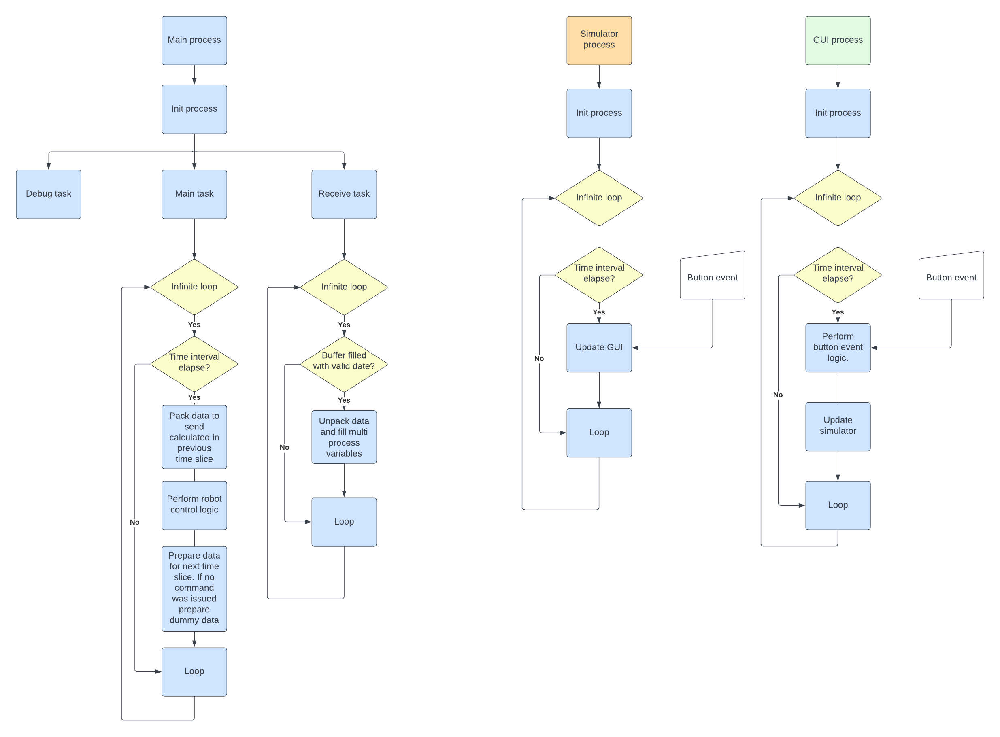
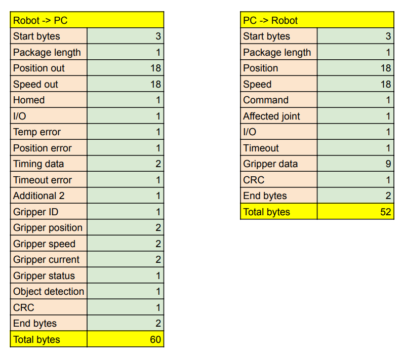
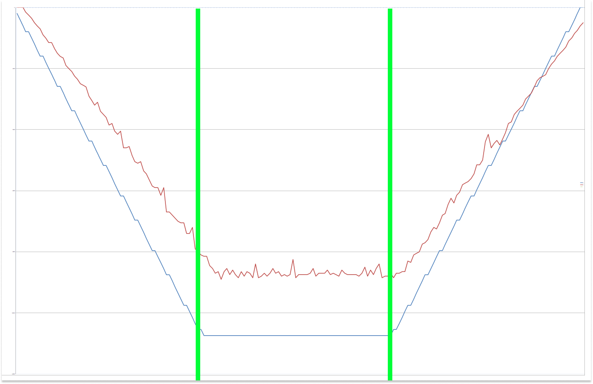
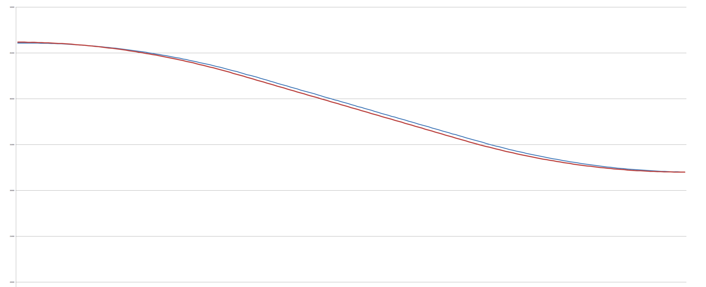
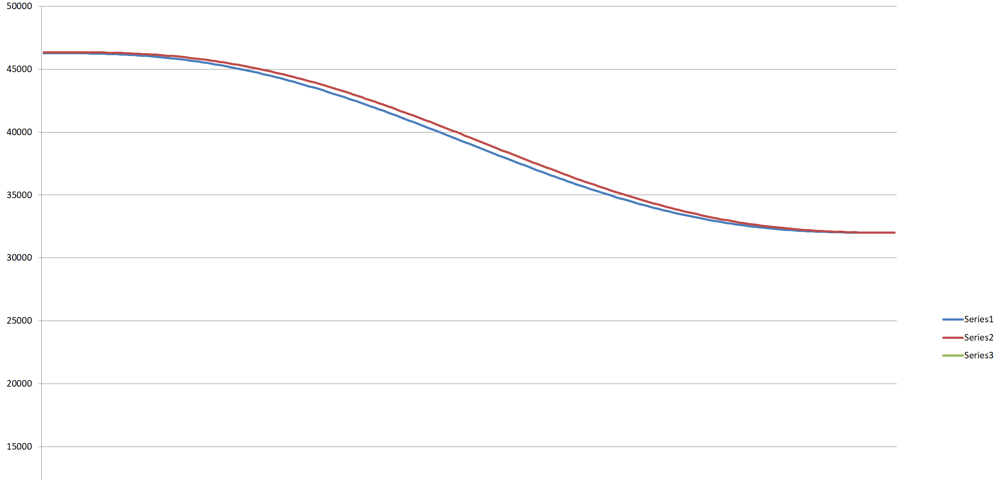

# Software

---

To operate the PAROL6 robot you need:

- High-level software running on your PC
- Low-level software running on the PAROL6 control board

For high-level software there are multiple options:

- Use PAROL6 commander software for control, programming, and simulation
- Use the [Python API](https://github.com/PCrnjak/PAROL6-python-API-Alvar) to send commands from your PC or remote PC 
- Use ROS

For low-level software, only the PAROL6 control board software is available. PAROL6 commander software allows you to write simple robot arm scripts using the scripting language **RBTscript**.

---

## Python API

!!! tip "Commander alternative"

    An alternative to the commander software is controlling the robot with the Python API. More info and a guide can be found in the [PAROL6 Python API repository](https://github.com/PCrnjak/PAROL6-python-API-Alvar).

---

### Client-Server Design
The system uses a UDP-based client-server architecture that separates robot control from command generation:

* **The Robot Controller (`headless_commander.py`)**: 
  - Runs on the computer physically connected to the robot via USB/Serial
  - Maintains a high-frequency control loop (100Hz) for real-time robot control
  - Handles all complex calculations (inverse kinematics, trajectory planning)
  - Requires heavy dependencies (roboticstoolbox, numpy, scipy)
  - Listens for UDP commands on port 5001

* **The Remote Client (`robot_api.py`)**: 
  - Can run on any computer (same or different from controller)
  - Sends simple text commands via UDP
  - Requires minimal dependencies (mostly Python standard library)
  - Extremely lightweight - can run on resource-constrained devices
  - Optionally receives acknowledgments on port 5002

* **Support Modules**:
  - `smooth_motion.py`: Advanced trajectory generation algorithms
  - `PAROL6_ROBOT.py`: Robot-specific parameters and kinematic model

Use test scripts to play around with the code. To run this first start headless_commander.py in one terminal and then write your scripts in another terminal like:


```python
from robot_api import move_robot_joints, home_robot, delay_robot, get_robot_joint_angles, control_pneumatic_gripper,get_robot_pose, control_electric_gripper, move_robot_pose,move_robot_cartesian,get_electric_gripper_status,get_robot_io
import time
print("Homing robot...") 
control_electric_gripper(action = "calibrate")
time.sleep(2)
control_electric_gripper(action='move', position=100, speed=150, current = 200) 
print(get_robot_joint_angles())
print(get_robot_pose())
print("Moving to new position...") 
control_pneumatic_gripper("open",1)
move_robot_joints([90, -90, 160, 12, 12, 180], duration=5.5)
time.sleep(6)
move_robot_pose([7, 250, 200, -100, 0, -90], duration=5.5) 
time.sleep(6)
move_robot_cartesian([7, 250, 150, -100, 0, -90], speed_percentage=50) 
delay_robot(0.2)
print(get_electric_gripper_status())
print(get_robot_io())
```

## PAROL6 commander software

Commander software can be found in the [PAROL Commander GitHub repository](https://github.com/PCrnjak/PAROL-commander-software). PAROL6 commander software is written in Python. Its main purpose is to offer an interactive GUI for controlling and programming the PAROL6 robot.

Some of the features of PAROL6 commander software:

- Built-in robot simulator
- Built-in programming language RBTscript
- Control loops of up to 100 Hz
- Robot jog in joint and Cartesian space
- Input and output control
- View of robot telemetry data
- E-stop and safety functions

---

### Structure

<p align="center">

</p>

---

### Dependency

The latest stable version uses Python 3.11.0. For dependency details see the [PAROL Commander repository](https://github.com/PCrnjak/PAROL-commander-software).

---

### How to run and install

1. Install the correct Python version.
2. Install all dependencies.
3. Clone or download the [PAROL Commander repository](https://github.com/PCrnjak/PAROL-commander-software).
4. Run `Serial_sender_good_latest.py`.

---

## PAROL6 control board software

We recommend using VS Code and PlatformIO to install, edit, and run the code.

---

### PAROL6 control board software install guide

1. Install [VS Code](https://code.visualstudio.com/).
2. In the VS Code extensions marketplace, install PlatformIO.
3. Clone or download the [PAROL6 GitHub repository](https://github.com/PCrnjak/PAROL6-Desktop-robot-arm).
4. In VS Code, click **Open Folder** and select the `PAROL control board` folder from the downloaded repository.
5. PlatformIO will automatically download all necessary configurations to allow you to compile and upload code.

---

### Code upload to PAROL6 control board

To upload code to your PAROL6 board, you need a programming cable and an ST-Link device. If you followed the steps in the install guide above, you can upload code directly from VS Code.

The programming adapter must be connected to the black connector next to the USB port. Required connections are: 3.3 V, GND, SWDIO, CLK.

---

### How to test the PAROL6 control board

Special testing software is available for testing the PAROL6 control board. Find it in the `TESTING` folder of the [PAROL6 repository](https://github.com/PCrnjak/PAROL6-Desktop-robot-arm).

This code allows you to control individual functions of the PAROL6 robot arm (when wired as per the wiring instructions).

---

## Communication protocol

Communication is based on UART over USB from the robot to the PC. The standard baud rate is 3 Mbit. Data is sent to the robot at 100 Hz (this can be reduced if your PC is not powerful enough, but performance will suffer). Data is sent in compact, specially packed data packets.

<p align="center">

</p>

*Figure: Data packet structure. Both packets combined are less than 120 bytes. At 3 Mbit transmission speed, a full round trip takes approximately 0.3 ms.*

The robot requires a valid data packet in the format defined above. Pseudocode of how it works on the PAROL6 control board:

```
While(1){

    Perform tasks

    While (Serial data available){
        // Read one byte from the buffer
        // Check that the 3 start bytes are correct
        // Once the Len byte is received, we know how many bytes to expect
        // After receiving that many bytes, check end bytes and CRC
        // Process the data, unpack it and save to corresponding variables
        // Pack the robot telemetry data to send back to the PC
    }

}
```

If the robot receives a valid data packet (correct start bytes, length, CRC, and end bytes), it begins processing the data and starts one robot loop cycle.

The PC (or any other device controlling the PAROL6) must send data at a sufficiently fast loop rate. The time between the last two commands is returned by the PAROL6 control board as `Timing data` — a 2-byte variable.

- Timer frequency: 90 MHz; with 128 prescaler = 703125 Hz (16-bit timer)
- Timer counts to 65535; 1 tick = 1/703125 ≈ 1.422 µs
- To represent 10 ms: 7031 ticks

Monitor this variable to verify your loop timing.

---

### PC → robot

The protocol from PC to robot consists of three types of commands:

- Active
- Passive
- Carrier

The protocol from robot to PC consists only of robot telemetry data.

---

#### List of active commands

Active commands are passed via the `command` argument and are represented by one byte (maximum 255 possible commands).

```
0x123 - JOG
0x156 - Go to position with speed
0x100 - Home command
0x101 - Enable robot
0x102 - Disable robot
0x103 - Clear error
0x255 - Dummy data
```

---

#### Passive commands

Passive commands include IO commands and gripper commands. They are always sent with the data packet and do not affect joint movement, so they can be injected into any active command.

---

#### Carrier commands

Carrier commands are joint speeds and positions that act as modifiers for active movement commands. 

---

#### Robot input packet (PC → robot)

```c
uint8_t start_bytes[] = {0xff, 0xff, 0xff};         // 3 bytes
int len = 52;                                       // 1 byte
int Joints[6];                                      // 3 bytes each; 18 bytes total
int Speed[6];                                       // 3 bytes each; 18 bytes total
int Command = 255;                                  // 1 byte
int Affected_joint[] = {1, 1, 1, 1, 1, 1, 1, 1};    // 1 byte
int InOut[] = {1, 1, 1, 1, 1, 1, 1, 1};             // 1 byte
int Timeout;                                        // 1 byte
int Gripper_position;                               // 2 bytes
int Gripper_speed;                                  // 2 bytes
int Gripper_current;                                // 2 bytes
int Gripper_command;                                // 1 byte
int Gripper_mode;                                   // 1 byte
int Gripper_ID = 212;                               // 1 byte
int CRC_byte = 212;                                 // 1 byte
int end_bytes[] = {0x01, 0x02};                     // 2 bytes
```


---

### Robot output packet (robot → PC)

Data sent from the robot to the PC consists of robot telemetry data and flags.

```c
uint8_t start_bytes[] = {0xff, 0xff, 0xff};             // 3 bytes
int len = 56;                                           // 1 byte
int Position_out[] = {255, 254, 253, 252, 251, 250};    // 3 bytes each; 18 bytes total
int Speed_out[] = {245, 244, 243, 242, 241, 240};       // 3 bytes each; 18 bytes total
bool Homed[] = {1, 1, 1, 1, 1, 1, 1, 1};                // 1 byte
bool IO_var[] = {0, 0, 0, 0, 0, 0, 0, 0};               // 1 byte
bool temp_error[] = {1, 1, 1, 1, 1, 1, 1, 1};           // 1 byte
bool position_error[] = {0, 0, 0, 0, 0, 0, 0, 0};       // 1 byte
int timing_data = 255;                                  // 2 bytes
int timeout_error = 244;                                // 1 byte
int xtr2 = 255;                                         // 1 byte
int gripper_ID = 200;                                   // 1 byte
int gripper_position = 300;                             // 2 bytes
int gripper_speed = 300;                                // 2 bytes
int gripper_current = 300;                              // 2 bytes
int gripper_status = 200;                               // 1 byte
int object_detection = 1;                               // 1 byte
int CRC_byte = 212;                                     // 1 byte
int end_bytes[] = {0x01, 0x02};                         // 2 bytes
```

---

## PAROL6 commander software

---

### Structure

<p align="center">

</p>

---

### How to run and install

See the [PAROL Commander repository](https://github.com/PCrnjak/PAROL-commander-software) for installation instructions.

---

## PAROL6 control board software

Structure of the code:

---

### PAROL6 control board software API

---

### Code upload to PAROL6 control board

To upload code to your PAROL6 board, you need a programming cable and an ST-Link device.

---

## Python API

Control PAROL6 via custom Python scripts, terminal, or LLMs using the [PAROL6 Python API](https://github.com/PCrnjak/PAROL6-python-API).

---

### RBTscript

PAROL6 commander software allows you to write simple robot arm scripts using the scripting language **RBTscript**. It allows you to move the robot in joint space or Cartesian space, use delay functions, control outputs and grippers, read inputs, and much more.

---

### Introduction

Commands are executed sequentially and are synchronised to the control loop time.

---

### Units used

Robotics involves many unit conversions. The following sections explain where these conversions happen in PAROL6 commander software and why.

---

#### Angle

Angles in the PAROL6 commander software GUI are in **degrees**. Commands sent to the PAROL6 control board are in **steps**. All internal calculations use **radians**.

---

#### Distance

Distances in the PAROL6 commander software GUI are in **millimetres [mm]**. The backend uses **metres** for all calculations.

---

#### Speed

Speed setpoints in the GUI are set using **%**. Internally, the backend uses STEPS/s, RAD/s, or DEG/s for rotational speed, and mm/s or m/s for translational speed.

---

#### Acceleration

Acceleration setpoints in the GUI are set using **%**. Internally, the backend uses STEPS/s², RAD/s², or DEG/s² for rotational acceleration, and mm/s² or m/s² for translational acceleration.


#### How to write code

#### How are trajectories generated?

#### How are they tracked?

There are 2 ways to command a robot trajectory. For example: we want Joint 6 to move from 260° to 180° following a trapezoidal velocity profile, completing the move in 2 seconds. We generate speed and position curves.

If we command only the speed curve, the robot will follow it smoothly, but if the move is too long or too fast, it may miss the commanded position. This happens because:

- Commands are sent every 10 ms, but the interval is not exactly 10 ms since a PC is not a real-time machine.
- Stepper motors cannot execute very small speed increments at the start and end of the speed curve.

To compensate, the position curve is also used. The algorithm calculates how fast the robot needs to move based on the difference between current and commanded position, then averages that with the commanded speed from the speed curve. The result is shown in the plots below.

In `MoveJoint`, `MovePose`, `MoveCart`, and `MoveCartRelTRF`, tracking mode (speed only vs. speed + position) is selected using the `speed` argument.

<p align="center">

</p>

*Figure: Trapezoidal velocity profile. Blue is the commanded velocity profile; red is the actual robot speed. Green lines show that the robot spends 1/3 of the path accelerating, 1/3 at cruise speed, and 1/3 decelerating.*

<p align="center">

</p>

*Figure: Position curve when tracking with speed only vs. speed + position. Both are very close, but with speed + position the robot reaches exactly the commanded position. This plot uses a trapezoidal velocity profile.*

<p align="center">

</p>

*Figure: Same commanded position using a polynomial profile. The same relationship applies as with the trapezoidal profile.*

### Functions

---

#### `MoveJoint(j1, j2, j3, j4, j5, j6, v=0, a=0, t=0, func, speed)`

Moves all robot joints to the desired positions, tracking a specific velocity curve. All joints stop at the same time. The path is linear in joint space — actuator motion is easy to validate and predict, but the TRF/end-effector path is not.

Supports trapezoidal or polynomial velocity profiles. You can set a desired move duration or specific acceleration and velocity. Tracking can be based on the speed curve alone or a combination of speed and position curves.

| Argument | Description | Unit | Required |
| --- | --- | --- | --- |
| `j1`–`j6` | Desired joint values | degrees | Yes |
| `a` | Desired acceleration/deceleration of the leading joint | % (0–100) | No |
| `v` | Speed of the leading joint | % (0–100) | No |
| `t` | Desired move duration | s | No |
| `func` | Velocity profile: `"poly"` or `"trap"` | — | No |
| `speed` | Set to `speed` to track speed curve only | — | No |

Arguments must be provided in the order listed above.

- If `t` is defined, the robot finishes the move in that time. `t` overrides `a` and `v`. The default profile is `"poly"` unless `func="trap"` is specified. With a trapezoidal profile and `t`, the speed profile is 1/3 acceleration, 1/3 cruise, 1/3 deceleration.
- If both `a` and `v` are defined, the robot uses a trapezoidal profile automatically. `a` and `v` apply to the **leading joint** (the joint travelling the longest distance). If the profile cannot be achieved for other joints, the algorithm selects appropriate values automatically.
- If only joint values are provided, the algorithm uses a conservative speed and acceleration with a `"trap"` profile.
- If `speed` is the last argument, the robot tracks only the speed curve. Motion will be smoother and quieter but may not reach the exact target position.

Examples:

```
MoveJoint(0,-90,180,0,0,180,t=4)
MoveJoint(0,-90,180,0,0,180,v=50,a=50)
MoveJoint(0,-90,180,0,0,180)
MoveJoint(0,-90,180,0,0,180,speed)
```

---

#### `MovePose(x, y, z, Rx, Ry, Rz, v=0, a=0, t=0, func, speed)`

Moves all robot joints to the desired **pose** (position and orientation), tracking a specific velocity curve. All joints stop at the same time. The path is linear in joint space.

Supports trapezoidal or polynomial velocity profiles. You can set a desired move duration or specific acceleration and velocity. Tracking can be based on the speed curve alone or a combination of speed and position curves.

| Argument | Description | Unit | Required |
| --- | --- | --- | --- |
| `x, y, z, Rx, Ry, Rz` | Desired robot pose | mm / degrees | Yes |
| `a` | Desired acceleration/deceleration of the leading joint | % (0–100) | No |
| `v` | Speed of the leading joint | % (0–100) | No |
| `t` | Desired move duration | s | No |
| `func` | Velocity profile: `"poly"` or `"trap"` | — | No |
| `speed` | Set to `speed` to track speed curve only | — | No |

Arguments must be provided in the order listed above.

The same rules as `MoveJoint()` apply. The difference is that the control algorithm calculates joint angles using inverse kinematics from the desired robot pose. This may result in a joint configuration different from what you intended.


#### `SpeedJoint()`

---

#### `MoveCart(x, y, z, Rx, Ry, Rz, t=0, func, speed)`

Moves all robot joints to the desired pose, tracking a specific velocity curve. All joints stop at the same time. The path is **linear in Cartesian/task space** — actuator motion is not necessarily smooth and is harder to validate.

With this mode, the robot cannot pass singularities and is affected by them. When the robot approaches a singularity, it will stop. The robot will attempt to execute the trajectory even if it contains a singularity — the user must design the task and robotic cell to avoid singularities.

| Argument | Description | Unit | Required |
| --- | --- | --- | --- |
| `x, y, z, Rx, Ry, Rz` | Desired robot pose relative to WRF | mm / degrees | Yes |
| `t` | Desired move duration | s | No |
| `func` | Velocity profile: `"poly"` or `"trap"` | — | No |
| `speed` | Set to `speed` to track speed curve only | — | No |

Arguments must be provided in the order listed above.

---

#### `MoveCartRelTRF(x, y, z, Rx, Ry, Rz, t=0, func, speed)`

Unlike `MoveCart`, where the pose is defined relative to the WRF, `MoveCartRelTRF` moves the robot pose relative to the **current Tool Reference Frame (TRF)**. The same singularity limitations as `MoveCart` apply.

| Argument | Description | Unit | Required |
| --- | --- | --- | --- |
| `x, y, z, Rx, Ry, Rz` | Pose relative to TRF | mm / degrees | Yes |
| `t` | Desired move duration | s | No |
| `func` | Velocity profile: `"poly"` or `"trap"` | — | No |
| `speed` | Set to `speed` to track speed curve only | — | No |

When rotating around multiple axes using `Rx`, `Ry`, `Rz`, it is recommended to use two successive commands:

```
MoveCartRelTRF(0, 0, 0, 0, 45, 0)
MoveCartRelTRF(0, 0, 0, 0, 0, 45)
```

---

#### `Delay(t)`

Delays the script by a specified time in seconds. The minimum delay equals `INTERVAL_S` (the robot control loop time, typically 10 ms).

```
Delay(1.5)  // Adds a time delay of 1.5 s
```

---

#### `End()`

Indicates that script execution stops at this point.

```
End()
```

---

#### `Begin()`

Indicates that script execution begins.

```
Begin()
```

---

#### `Loop()`

When the script reaches this command, it restarts from the beginning.

```
Loop()
```

---

#### `Output(output, state)`

Sets one of the 2 outputs to HIGH or LOW.

```
Output(1, HIGH)  // Sets output 1 of the PAROL6 control board to HIGH
Output(2, LOW)   // Sets output 2 of the PAROL6 control board to LOW
```

---

#### `Gripper_cal()`

Calibrates and activates the gripper. Add a `Delay()` after calling it to allow the calibration to complete.

```
Gripper_cal()
Delay(2)
```

---

#### `Gripper(position, speed, current)`

Controls the SSG48 gripper connected to your PAROL6 robot.

| Argument | Description | Range |
| --- | --- | --- |
| `position` | Position setpoint | 0 (fully open) – 255 (fully closed) |
| `speed` | Move speed | 0 (slowest) – 255 (full speed) |
| `current` | Force applied to object | 0 – 1300 mA (values below 150 mA are usually too low to move the gripper) |

!!! danger

    Be careful when using large current values (above 700 mA) paired with high speed setpoints — this can cause damage to the robot and objects being grasped.

After calling a `Gripper()` command, the program immediately moves to the next command. Use `Delay()` after it to allow the gripper to complete its motion.

```
Gripper(120, 30, 500)  // Move gripper to position 120 at speed 30 with 500 mA current
Delay(2)
```

---

### Example codes

---

#### Simple joint space move

This code performs small joint space movements in a loop.

```
Begin()
Delay(1)
MoveJoint(85.078,-111.195,143.513,-32.92,18.084,129.448,t=3)
Delay(1)
MoveJoint(66.129,-117.368,136.77,46.28,-29.588,149.293)
Delay(1)
Loop()
```

---

#### Cartesian TRF example

This code moves the robot in TRF space — first translating in x, y, z, then rotating around x, y, z of the TRF. Watch the simulator window to see how the robot follows the axes.

```
Begin()
Delay(1)
MoveJoint(90.0,-90.0,180.001,0.0,0.0,180.0,t=4)
Delay(1)
MoveCart(0.0,263.23,161.241,-90.0,0.0,-89.499)
Delay(1)
MoveCart(81.565,262.804,161.047,-90.135,-0.029,-89.578)
Delay(1)
MoveCart(81.649,194.981,160.077,-90.14,-0.043,-89.593)
Delay(1)
MoveCart(83.598,194.356,161.493,-91.155,1.306,-80.28)
Delay(1)
MoveCart(84.56,194.131,162.347,-48.387,1.261,-80.188)
Delay(1)
MoveCart(82.89,191.698,162.369,-40.587,26.026,-107.028)
Delay(1)
End()
```

---

#### Cartesian relative TRF

This code moves the gripper relative to its last position. In this example, the gripper moves -80 mm in the x direction of the TRF.

```
Begin()
Delay(1)
MoveJoint(90.0,-90.0,180.001,0.0,0.0,180.0,t=4)
Delay(1)
MoveCartRelTRF(-80,0,0,0,0,0)
Delay(1)
End()
```

---

#### SSG48 gripper test

This code calibrates the gripper and performs a few open/close operations, then makes a small joint space move followed by a small Cartesian TRF move.

!!! note

    If there is a gripper error, you must manually clear it in the Gripper tab of the GUI.

```
Begin()
Gripper_cal()
Delay(3)
Gripper(100,60,600)
Delay(2)
Gripper(200,60,600)
Delay(2)
MoveJoint(85.192,-104.451,158.769,-1.983,-46.491,179.899,t=6)
Delay(1)
MoveCart(4.317,103.384,192.319,-84.465,1.447,-143.154)
Gripper(100,60,600)
Delay(2)
End()
```

---

#### Output click example

This code toggles OUTPUT1 of the robot arm on and off. You can use this to control a pneumatic gripper.

```
Begin()
Output(1,HIGH)
Delay(1)
Output(1,LOW)
Delay(1)
Loop()
```
