# PAROL6 Commander GUI

When you start the PAROL6 commander software, you will see two windows:

- Commander window
- Simulator window

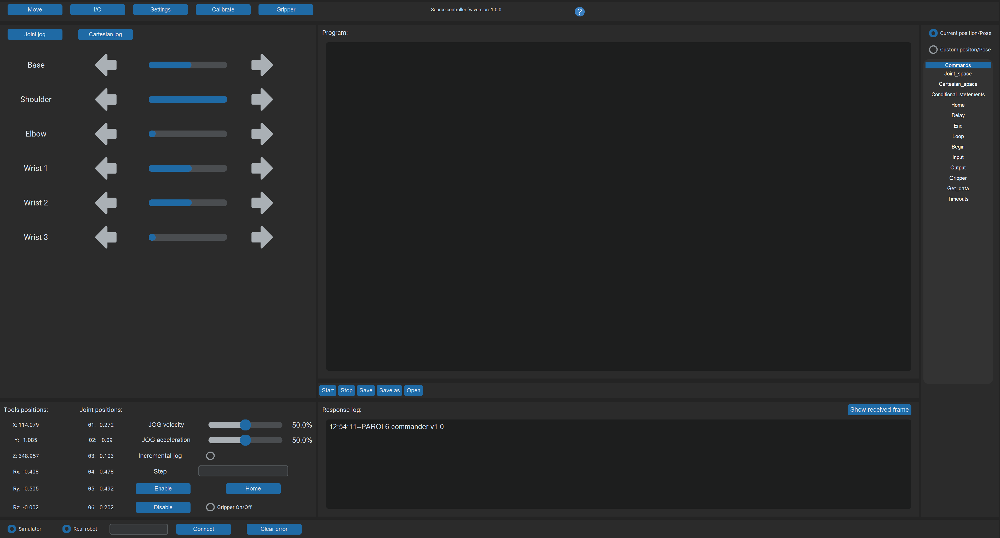

*Fig — Commander window*

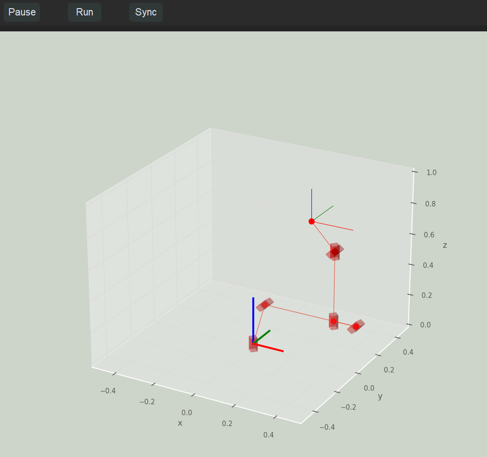

*Fig — Simulator window*

The commander window is used to jog the robot, read logs, write programs, and home the robot. The simulator window shows the robot's live position in 3D.

!!! note

    The simulator only works when your robot is connected.

*Fig — Connection bar*

At the bottom of the commander software window, you will see an entry bar and a Connect button.

In the field next to the Connect button, enter your serial COM port:

- **Windows:** enter `COMx` (where `x` is your COM port number)
- **Linux:** enter `ttyACMx` (where `x` is your COM port number)

The Clear Error button has the same function as the Enable button.

The Sim and Real Robot buttons have no function at the moment.

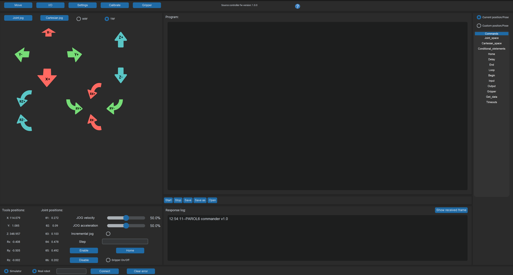

*Fig — Cartesian jog*

Cartesian jog is used to move the robot in Cartesian space. You can use the TRF (Tool Reference Frame) or WRF (World Reference Frame). TRF uses axes relative to the end effector, while WRF uses axes relative to the robot base.

!!! note

    When jogging in Cartesian mode, you may encounter singularities. See the General Concepts section for more information.

*Fig — Joint jog*

Joint jog is used to jog individual motors. Left is the **positive** direction; right is the **negative** direction.

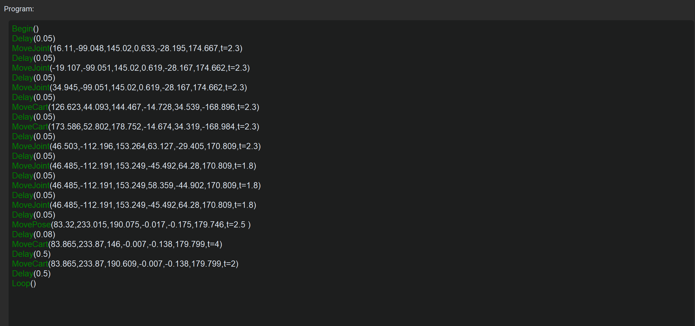

*Fig — Program window*

This window allows you to write robot scripts. See the Software section for more details.

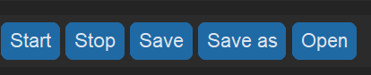

*Fig — Start/stop tab*

Press **Start** to begin program execution. Press **Stop** to halt it.

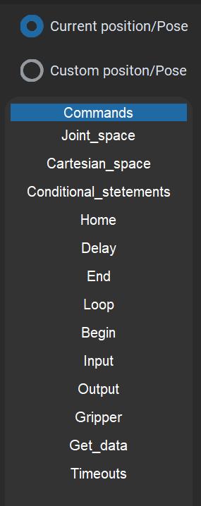

*Fig — Commands window*

This window lets you select commands and click to add them to the program window. Movement commands that use the current position or pose (such as `MoveJoint`, `MovePose`, `SpeedJoint`, `MoveCart`, `MoveCartRelTRF`, `SpeedCart`) will automatically insert the current pose or joint position as arguments. Custom position/pose commands will not add any values.

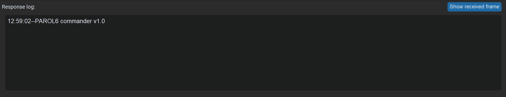

*Fig — Response log*

The response log shows error logs and active commands.

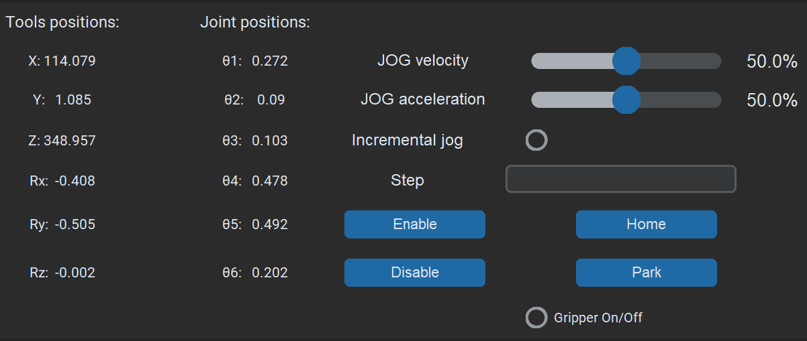

*Fig — Robot position*

Here you can see the robot's joint positions and the end-effector position in Cartesian space. Use the slider to adjust joint and Cartesian velocity. The **Home** button starts the homing sequence. The **Enable** button clears all errors and enables the robot for operation. **Disable** disables the robot.

Everything described above is located in the Move menu. All other menus keep the same layout — only the jog menus are replaced with different content.

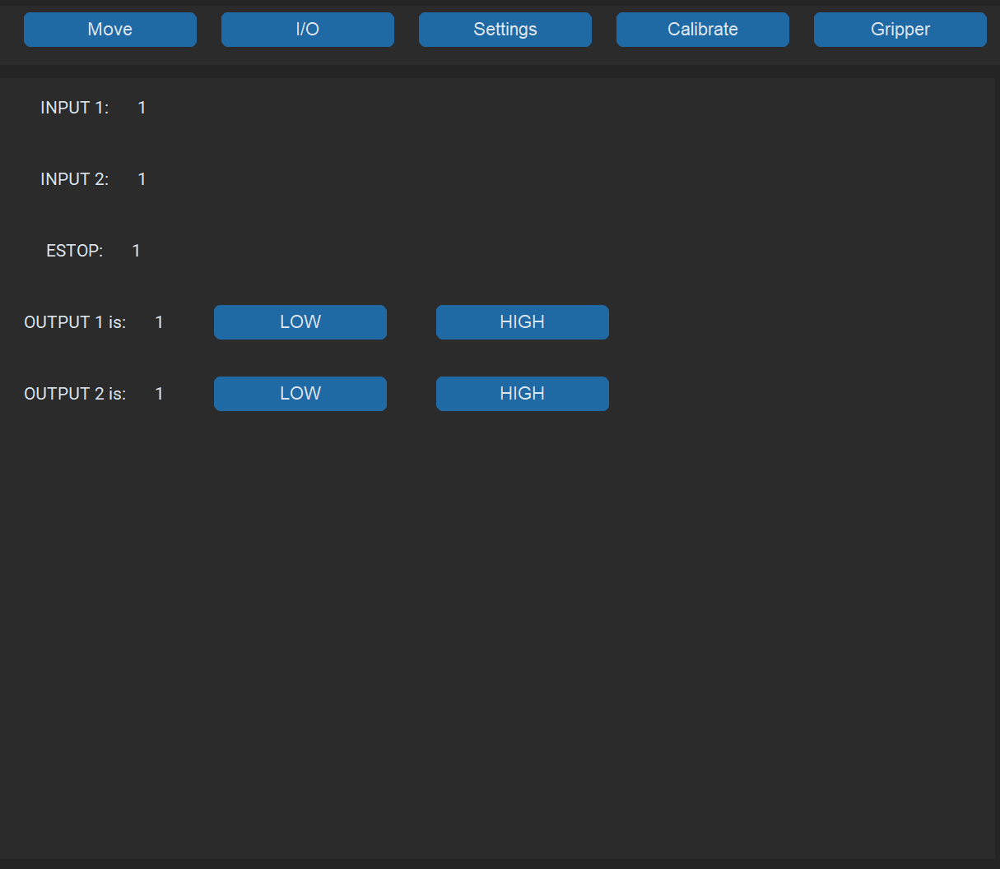

*Fig — IO tab*

Here you can check the state of your inputs and set the desired state of your outputs.

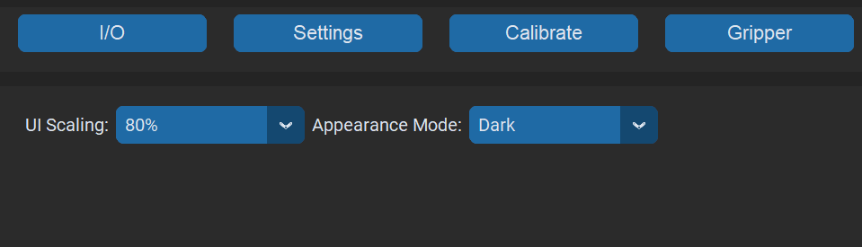

*Fig — Settings tab*

Here you can switch the GUI between dark and light mode, and adjust scaling to fit your display.

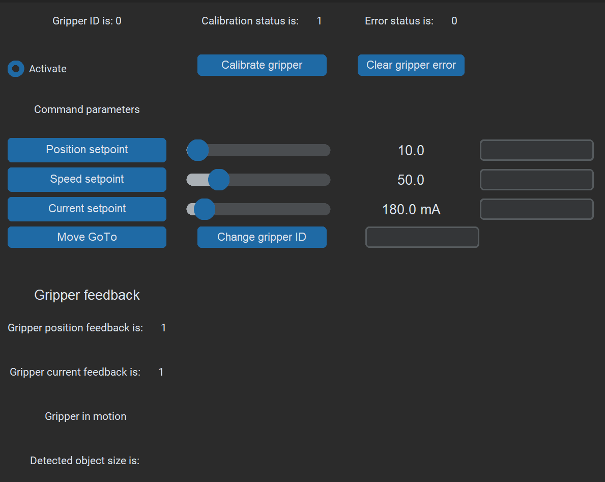

*Fig — Gripper tab*

Here you can control and configure your gripper.

1. After homing the robot, press **Calibrate Gripper**. The gripper will start to move and its status will change to *Calibrated*.
2. Press **Clear Gripper Error**.
3. Use the sliders to set the desired position, speed, and torque, then press **Move GoTo**.

Under Gripper Feedback, you can see gripper current, position feedback, and status (in motion, object detected, etc.).

