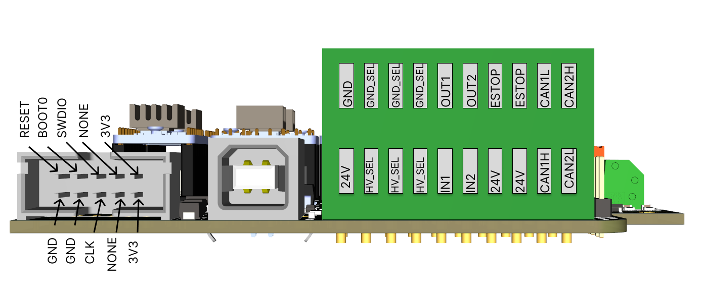
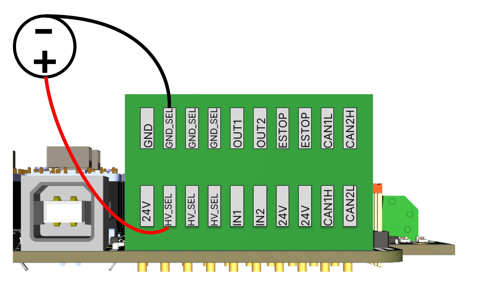
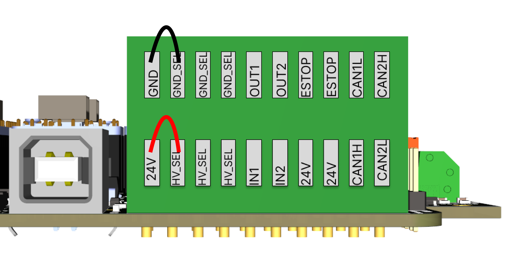
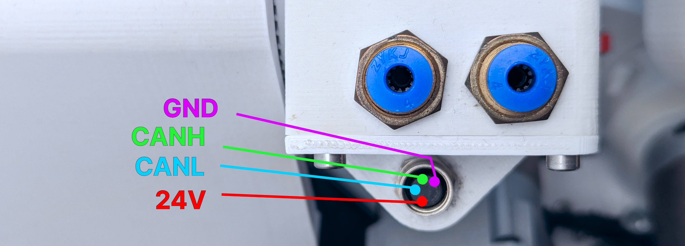
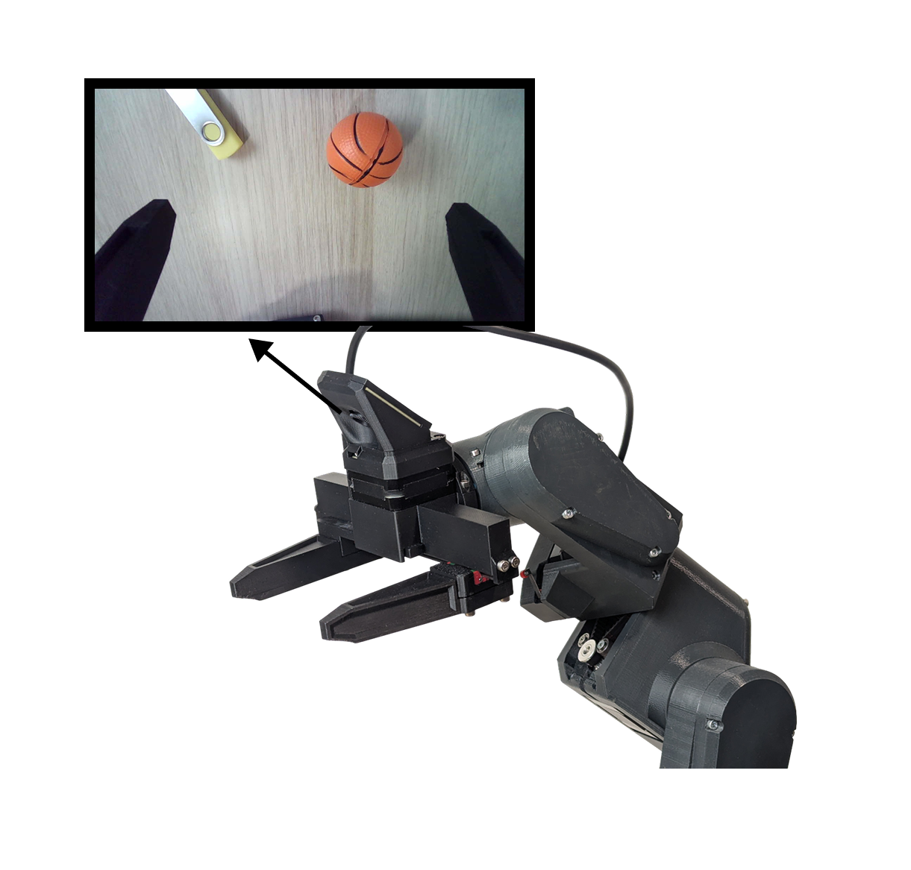
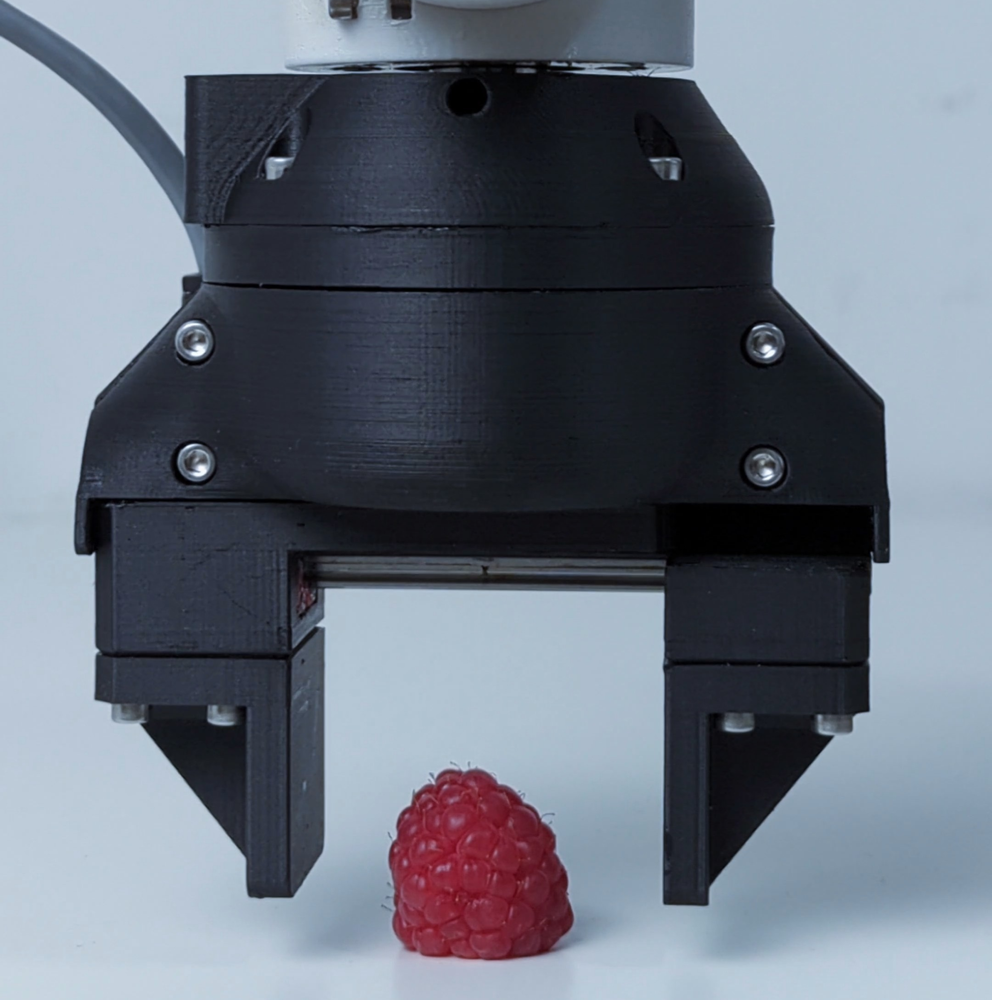
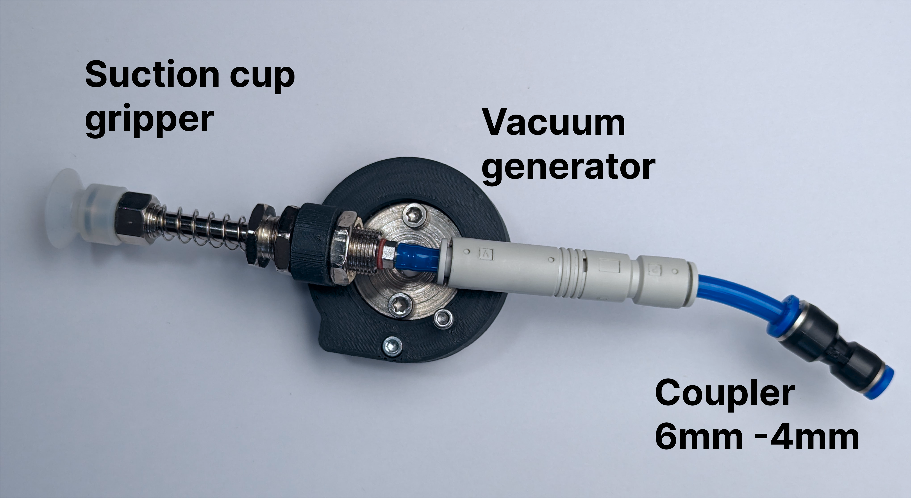
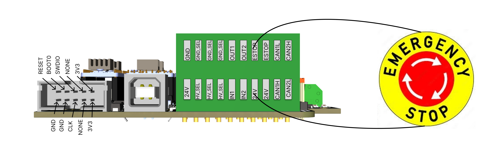

# Peripherals

The PAROL6 control board has multiple ways to interact with the outside world. Communication with high-level code running on a PC is done over USB, but you can also use other features such as I/O or CAN.

## I/O connections

PAROL6 is equipped with 2 isolated inputs and 2 isolated outputs.

### Isolated power supply

It is standard practice to use isolated inputs and outputs to protect your device. To use an isolated power supply, follow the connections shown in the image below. Connect the negative terminal of the power supply to any **GND_SEL** pin and the positive terminal to any **HV_SEL** pin.

!!! note

    Even though inputs and outputs are now isolated from the robot, the E-stop is still connected to the robot's power supply.

Using an isolated power supply means you are not limited to 24 V — you can use 5 V or 12 V depending on your application.

### Not isolated power supply

Following the connections shown in the image below will connect all inputs and outputs to the robot's power supply.

### Examples of input connections

Inputs can be limit switches, push buttons, sensors, and similar devices. For a limit switch, connect one end to **HV_SEL** and the other to IN1 or IN2.

### Examples of output connections

Outputs can be relays, lamps, low-power actuators, and similar devices. For a relay, connect one end to **GND_SEL** and the other to OUT1 or OUT2.

## CAN bus

!!! tip "Still under development"

CAN bus will allow you to connect external grippers and additional axes. There are 2 CAN buses. Note that CAN2 is not soldered by default.

## MSG gripper

!!! Note "MSG and SSG48 gripper use the same CAN interface and have support for all the same commands!"

---

The gripper connects to the connector shown above on the PAROL6 robotic arm. If building your own robot and gripper, make sure you follow the wiring instructions — failing to do so can destroy your gripper and control board. Test the PAROL6 robot first, then attach the gripper. Troubleshooting both at the same time is difficult.

The [MSG gripper](https://github.com/PCrnjak/MSG-compliant-AI-stepper-gripper) works by default with PAROL6 commander software and the control board. There is no need to configure anything — it is plug and play. To build one visit: [Link](https://github.com/PCrnjak/MSG-compliant-AI-stepper-gripper) or to buy one, visit the [Source Robotics shop](https://source-robotics.com/products/msg-gripper).

## SSG48 gripper

The gripper connects to the connector shown above on the PAROL6 robotic arm. If building your own robot and gripper, make sure you follow the wiring instructions — failing to do so can destroy your gripper and control board. Test the PAROL6 robot first, then attach the gripper. Troubleshooting both at the same time is difficult.

The [SSG48](https://github.com/PCrnjak/SSG-48-adaptive-electric-gripper) works by default with PAROL6 commander software and the control board. There is no need to configure anything — it is plug and play. To build or buy one, visit the [Source Robotics shop](https://source-robotics.com/products/compliant-gripper).

!!! note "Change in main.cpp"

    If using the SSG48 gripper, change `j5_homing_offset` in `main.cpp` to `8035`.

## Pneumatics

!!! note "Recommended pressure"

    The recommended pressure for PAROL6, and generally in industry, is 6–8 bar. All pneumatic examples in our videos use pressures in that range.

### Example of gripper connection

The 2 tubes going into a gripper exit the PAROL6 robotic arm at the forearm. The tubes from the pneumatic valve must be connected to the pneumatic connections at the base of the robot. Orientation matters — swapping the 2 tubes will change the gripper between normally closed and normally open.

Connect the valve wires to **GND_SEL** and **OUTPUT1**.

### Vacuum gripper

You will need to print the vacuum gripper holder from the GitHub folder. By default the gripper will spin freely; if you don't want that, tie it with a zip tie to the screw shown in the image.

You will need to block one port of the pneumatic valve. Use a tube of a fitting size and screw in an M3 screw with threadlocker.

## E-stop

Connection is as follows:

!!! warning

    The E-stop must be connected for normal operation of the robot.

!!! tip

    If you don't have an E-stop, you can use any normally closed (NC) switch.

!!! tip

    The PAROL6 control board has connectors for 2 E-stops. Both share the same GPIO on the microcontroller and both must be NC contacts.

The E-stop must be a **normally closed (NC)** contact type — normally open (NO) will not work. NC is beneficial because if the E-stop is unplugged or its wires are cut, it will also register as an E-stop press, which is the desired behaviour.

