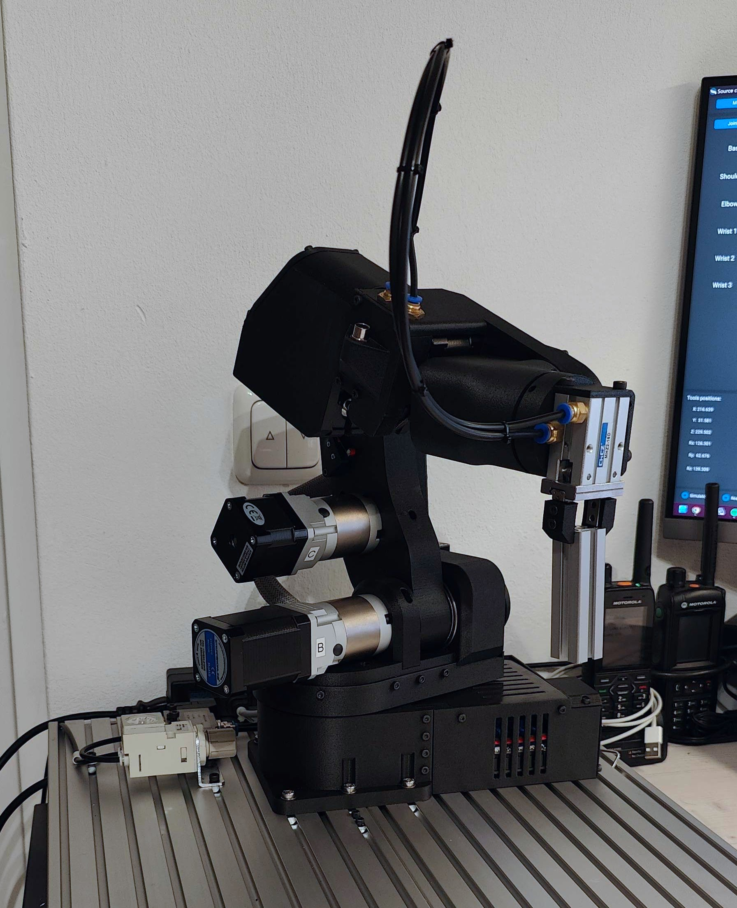
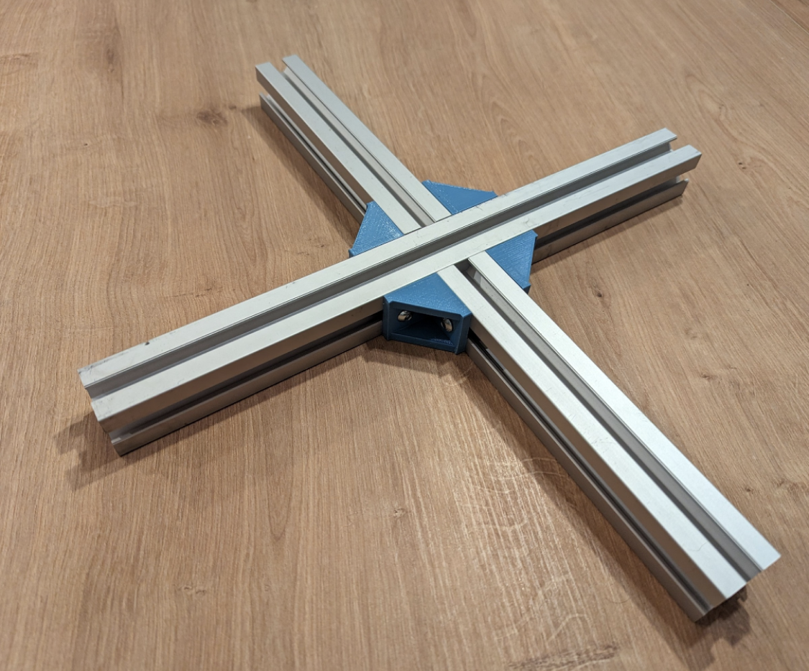
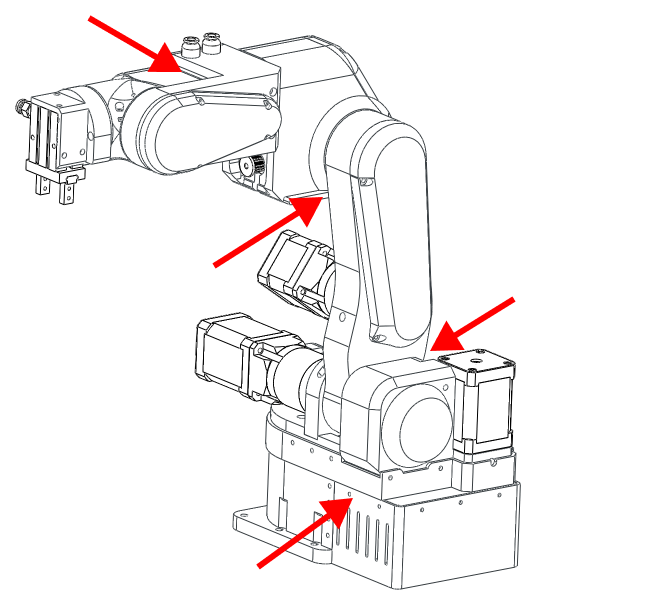

# Safety and handling

!!! warning

    Not following these procedures can cause damage to the robot and the operator. Make sure you read and follow them.

PAROL6 requires special handling even though it is a lightweight desktop robot. Weighing only 5 kg, it still needs to be anchored to a surface. In the event of power loss, the robot's joints will not hold themselves and the robot will begin to fall. This is a property of the relatively low reduction ratios in PAROL6.

!!! info "Addition of brakes"

    The solution to this problem, as used in industrial applications, is to add brakes. Adding brakes is on the TODO list for PAROL6.

PAROL6 requires 3 connections for normal operation.

- Power connection — marked green in the image
- USB connection — marked blue in the image
- E-stop — marked with yellow and pink squares (one lead to pink, one to yellow)

## Code upload

When uploading code to the PAROL6 control board, turn off the 24 V power supply first. During code upload the board receives 3.3 V from the ST-Link device, which keeps the robot on and prevents shutdown via the power button on the base. After the code upload is complete, disconnect the ST-Link, turn the robot on using the base power button, and then run PAROL6 commander software.

## USB

The USB connection does not power the board.

## Safe shutdown

!!! danger

    Do not try to power off the robot while it is running. If the robot behaves unexpectedly, use the E-stop. If the E-stop is not functional, switch off the power supply. Reaching for the power button should be the last resort.

Due to the lack of brakes, a sudden loss of power will cause the robot to fall, which may damage the robot or injure the operator. The robot is powered on and off by pressing the button marked red in the image. When powering on, even without a USB connection, the robot will energise the motors and produce 6 clicking sounds — this is normal behaviour.

To power off, press the red button. Before doing so, **grab the robot by the forearm** to prevent it from falling.

## Anchoring the robot

!!! danger

    A robot that is not anchored will fall over.

There are 2 ways to anchor the robot:

- Using the 6 holes in the base to bolt it to a surface
- Using clamps to attach it to the edge of a table or work surface

The base holes are spaced for easy mounting on 30×30 mm aluminium profiles.

Another option is to use `connectors_4_alu_profiles.STL`, found in the STL folder of the [PAROL6 GitHub repository](https://github.com/PCrnjak/PAROL6-Desktop-robot-arm), to create a base as shown in the image below. You will also need:

- T-nuts for 30×30 mm profile (M5)
- M5 × 12 mm screws
- M5 × 18–20 mm screws

## Pinching points

Be careful when the robot is running. There are several pinching points that can injure you and others. Make sure any additional wires or tubes are kept clear of the pinching points.

## Joint limits

!!! warning

    Never rotate joint 5 more than one full rotation.

The image above shows the range of J5.

## Transport

When moving the robot it is best to first move joints 2 and 3 to the limit switches. Then grab the robot by the base to carry it.

When packing the robot, place some foam or styrofoam under the J3 limit switch, then tape around the forearm and upper arm links.

## E-stop

!!! warning

    The E-stop must be connected for normal operation of the robot.

!!! tip

    If you don't have an E-stop, you can use any normally closed (NC) switch.

!!! tip

    The PAROL6 control board has connectors for 2 E-stops. Both share the same GPIO on the microcontroller and both must be NC contacts.

The E-stop must be a **normally closed (NC)** contact type — normally open (NO) will not work. NC is beneficial because if the E-stop is unplugged or its wires are cut, it will also register as an E-stop press, which is the desired behaviour.

