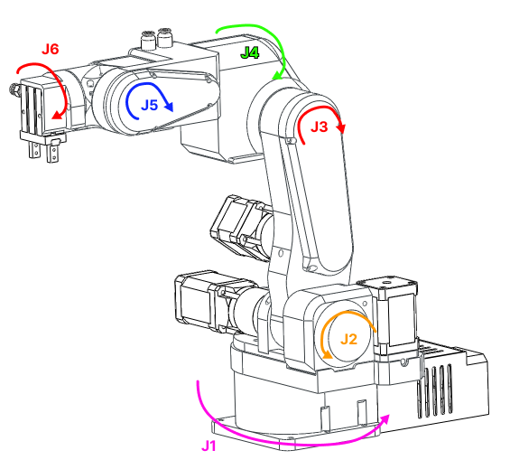
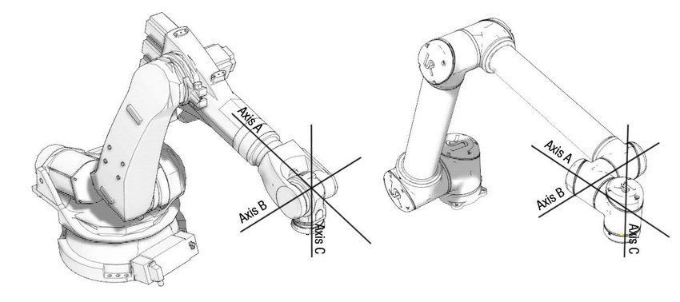
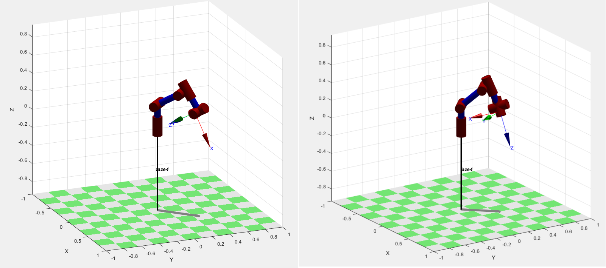
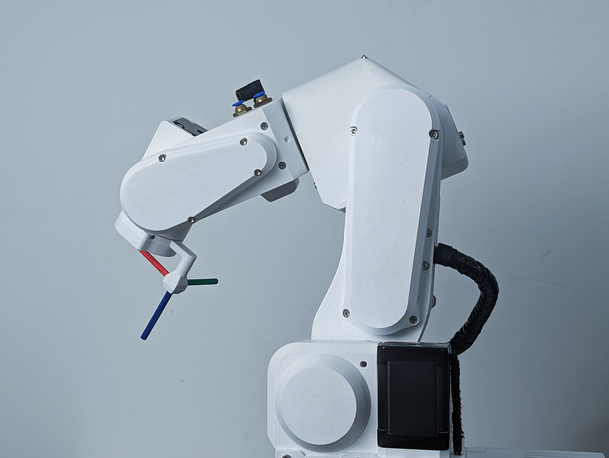
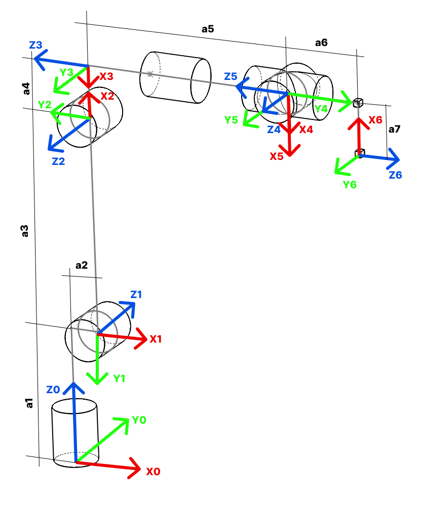
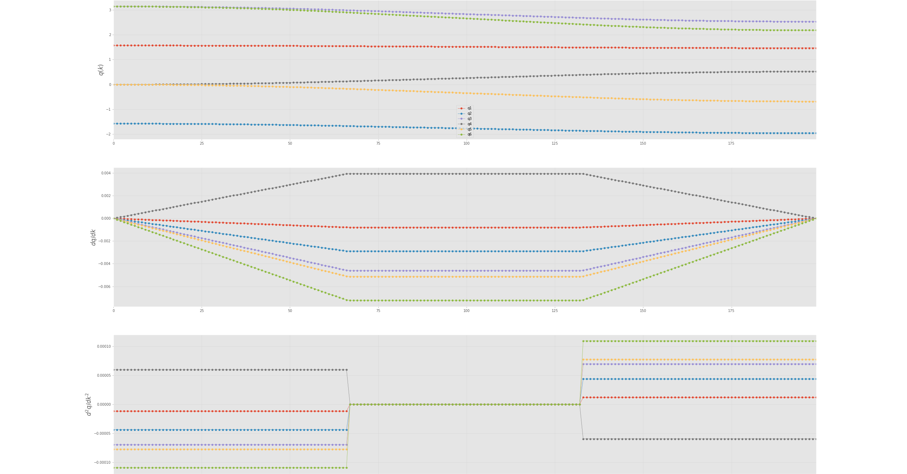
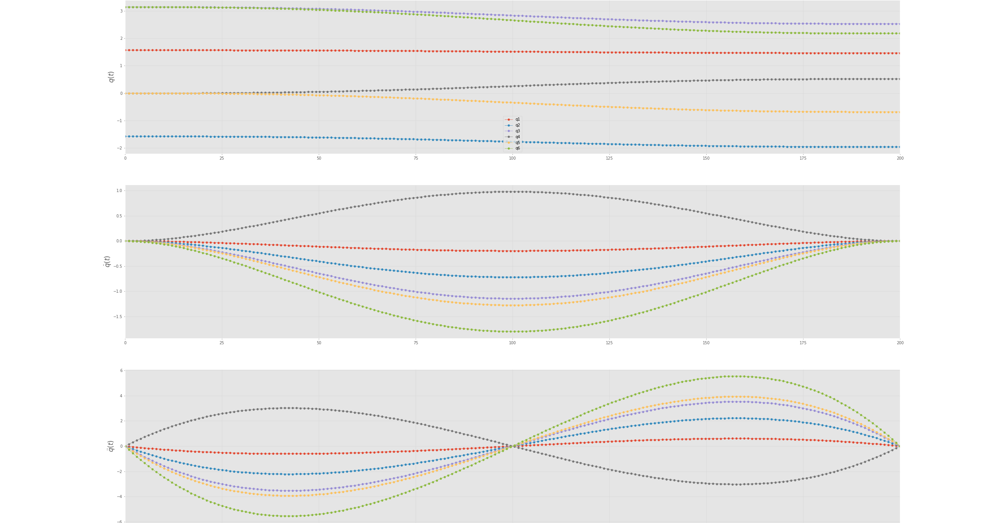
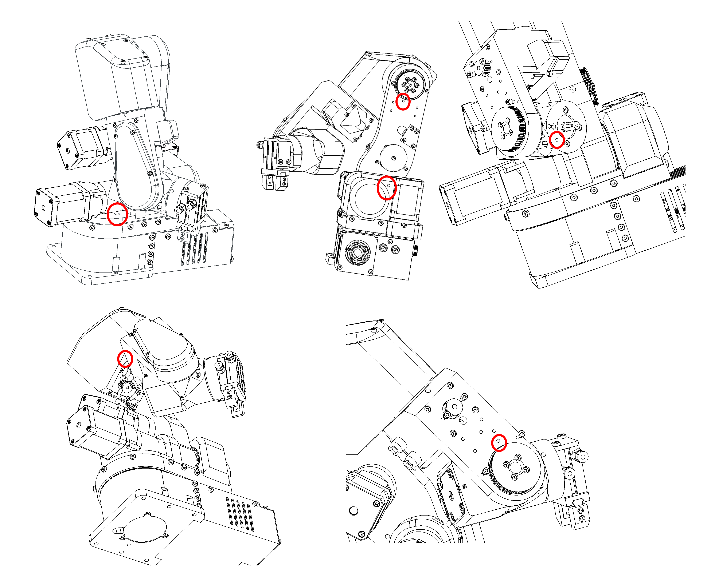

# General concepts

The PAROL6 robotic arm serves as an exceptional tool for educators aiming to enhance their students' understanding of robotics and automation. Its innovative design and user-friendly features make it an ideal platform for various educational settings. In our commitment to fostering a deep understanding of robotics and empowering educators to enhance their curriculums, the PAROL6 documentation includes a dedicated "Theory Corner." This section serves as a valuable resource for individuals seeking to delve into the theoretical foundations of robotics and educators striving to enrich their teaching materials.

The Theory Corner is designed to provide comprehensive explanations of essential robotic concepts. Whether you're a newcomer to robotics or a seasoned enthusiast, this section offers insights into topics such as kinematics, dynamics, control systems, sensors, programming languages, and more. 

!!! note

    This section is still a work in progress and is being constantly updated.

---

## Want to know more?

Here is a list of great resources for learning more about robotics:

- [Robot Academy](https://robotacademy.net.au/)
- [Automatic Addison](https://automaticaddison.com/)
- [Robogrok](https://robogrok.com/)
- [Robotics coursework (mithi)](https://github.com/mithi/robotics-coursework)
- [Robotics Explained](https://robotics-explained.com/)
- [Robotic Sea Bass](https://roboticseabass.com/2024/06/30/how-do-robot-manipulators-move/)
- [Robohub — how many axes does my robot need?](https://robohub.org/how-many-axes-does-my-robot-need/)

---

## Basic theory

---

### Joints and naming

Joints are numbered from the bottom to the top of the arm. For PAROL6 this follows the naming shown in Figure 1.

*Figure: Robot joint naming*

---

### Rules and conventions

---

#### Right-hand rule for axes

The right-hand rule is a convention used to define the orientation of coordinate systems in three-dimensional space. It provides a consistent way to determine the positive directions of the axes (x, y, and z) relative to each other.

How to apply the right-hand rule when assigning coordinate systems:

- **Thumb**: Align your right thumb along the positive direction of the first axis (usually the x-axis), which typically points to the right.
- **Index finger**: Extend your right index finger perpendicular to your thumb. This represents the positive direction of the second axis (usually the y-axis), often considered the "up" direction.
- **Middle finger**: Orient your right middle finger perpendicular to both your thumb and index finger. The middle finger represents the positive direction of the third axis (usually the z-axis), forming a right-handed coordinate system.

With your hand in this configuration, the three fingers define the positive directions of the x, y, and z axes respectively. For rotation, point your thumb in the positive direction of the axis you want to rotate around — your fingers then curl in the positive direction of rotation.

---

## Concepts

---

### Types of robots and number of joints

There are many robot types in industry, usually categorised by number of joints and how they are arranged. Common types include:

- Vertically articulated
- Cartesian
- Cylindrical
- Polar
- Selective compliance assembly robot arm (SCARA)
- Delta

PAROL6 is a vertically articulated robot. All concepts here apply to any type of robot, but most examples will be for robots like PAROL6.

---

### Spherical wrist

The first 3 axes position the end effector in Cartesian space, while the last 3 joints control end-effector orientation. PAROL6 uses a popular configuration where the rotation axes of the last 3 joints intersect — this is called a spherical wrist and is one of the most common configurations in industrial robots. A spherical wrist allows much easier and faster calculation of inverse kinematics. An example of a spherical wrist is shown below using the Faze4 robotic arm.

*Figure: Left — robot with spherical wrist; right — robot without spherical wrist.*
---

### Robot pose

In robotics, the term "pose" refers to the position and orientation of a robot in its environment. It provides a complete description of where the robot is located and how it is oriented relative to a specific coordinate system or reference frame. The pose includes:

- **Position**: The location of the robot in the environment. In 2D space this is represented as (x, y); in 3D space it includes three coordinates (x, y, z) relative to a fixed reference point.
- **Orientation**: The rotation of the robot in space. In 2D this can be an angle (θ); in 3D it is often described using Euler angles, roll-pitch-yaw, or rotation matrices.

The combination of position and orientation fully defines the robot's pose at a specific moment in time.

---

#### Orientation

A 6-axis robot has 6 joints — in this case, 6 rotational joints connected by links. The advantage of this type of robot arm is that it can reach the same position in space with different orientations. Both pictures below show the arm at position x = 0.3 m, y = 0.3 m, z = 0.2 m, but with different orientations. The robot's pose in 3D space is described by the position and orientation of the end effector.

*Figure: Same position in space, different orientation.*

---

### Frames

Coordinate frames are often placed at each joint to show the orientation and position of each joint relative to a common reference frame. These frames define the transformations between different segments of the arm.

---

#### WRF — World reference frame

The World Reference Frame (WRF) is a static frame fixed in the real world. It is usually located at the base of the robot. For PAROL6 the WRF is at the base. The coordinate frame in the figure represents the world frame.

---

#### TRF — Tool reference frame

The Tool Reference Frame (TRF) is the reference frame associated with the robot's end effector. This frame changes depending on the end effector being used.

*Figure: Robot with TRF shown at the end effector.*

---

### Links

Links represent the rigid segments of the robotic arm — either physical components or conceptual representations. Links are typically depicted as straight lines connecting joints. Examples include the shoulder, wrist, and forearm.

---

### Joints

Joints represent the articulation points where motion occurs. These include revolute joints (rotational) and prismatic joints (linear). Joints are often shown as small circles or symbols with labels indicating the type and degree of freedom.

---

### Kinematic diagram

A kinematic diagram of a robotic arm is a simplified graphical representation that shows the arrangement of links and joints. It conveys the essential geometric and kinematic relationships between components without capturing all physical details.

---

### Denavit-Hartenberg parameters

Denavit-Hartenberg (DH) parameters are a set of standardised parameters used to describe the geometry and kinematics of robotic arms. They provide a systematic way to represent the transformation between consecutive coordinate frames along a robot's kinematic chain. These parameters were introduced by Jacques Denavit and Richard S. Hartenberg in the 1950s and have become a fundamental tool in robotics.

The four DH parameters for each joint are:

- **Link length**: distance along Zᵢ₋₁ from Oᵢ₋₁ to the intersection with Xᵢ
- **Link offset**: distance from Oᵢ₋₁ to Oᵢ measured along Xᵢ
- **θ (theta)**: rotation around Zᵢ₋₁ to align Xᵢ₋₁ with Xᵢ
- **α (alpha)**: rotation around Xᵢ to align Zᵢ₋₁ with Zᵢ

By applying a sequence of transformations using these parameters you can calculate the overall transformation matrix representing the position and orientation of each link relative to a reference frame.

Useful guides:

- [How to assign DH frames to robotic arms](https://automaticaddison.com/how-to-assign-denavit-hartenberg-frames-to-robotic-arms/)
- [How to find DH parameter tables](https://automaticaddison.com/how-to-find-denavit-hartenberg-parameter-tables/)

---

### Forward kinematics

Forward kinematics is a fundamental concept in robotics that involves determining the position and orientation of a robot's end effector (such as a gripper or tool) based on the known joint angles and link parameters. In simpler terms, it's the process of calculating the robot's pose (position and orientation) in space given the joint configurations.

The forward kinematics problem is about understanding how the robot's various joints and links combine to determine the position and orientation of the end effector. It's like tracing the path of the robot's movements to find out where its hand or tool ends up.

---

### Inverse kinematics

Inverse kinematics is a fundamental concept in robotics that involves determining the joint angles or parameters of a robotic mechanism in order to achieve a desired end-effector position and orientation. In simpler terms, it's the process of calculating the joint configurations that will result in a specific pose (position and orientation) of the robot's end-effector (e.g., its hand or tool).

In a robotic arm, for example, the forward kinematics process involves calculating the position and orientation of the end-effector based on the given joint angles. Inverse kinematics, on the other hand, works the opposite way: given a desired position and orientation for the end-effector, it calculates the joint angles that will achieve that particular pose.

Inverse kinematics can be quite complex, especially for robots with multiple joints and degrees of freedom. Solving inverse kinematics involves finding solutions to sets of nonlinear equations that relate the joint variables to the desired end-effector pose. Depending on the robot's geometry and the specific task at hand, there may be multiple solutions, a unique solution, or even no solution.

Inverse kinematics is crucial for tasks such as trajectory planning, motion control, and object manipulation, as it allows the robot to determine how to move its joints to achieve a specific goal in its operational environment. It's used in applications ranging from industrial robotics and automation to animation and simulation.

---

### Singularity

When a robot navigates through Cartesian space, the reference frame transitions from individual joints to the end effector. The robot employs various joint movements to achieve the desired Cartesian motion for the end effector. To optimize joint movements, the robot calculates the necessary displacement and direction for each joint. This method generally works efficiently for most arm configurations. However, challenges arise at singularities, which occur when joints reach their limits or when two or more joints align collinearly.

At these joint alignments, certain movements within Cartesian space become unattainable, leading to exceedingly high joint velocities. The mathematical equations governing the robot's motion approach singularity when divided by  small values. The actual singularity manifests when one of these equations is divided by zero, signifying the impossibility of the movement.

Singularity point represent critical zones where the robot's kinematic equations encounter mathematical limitations due to specific joint configurations, resulting in movement impossibilities or erratic behavior.

 [Video demonstration of singularities](https://www.youtube.com/watch?v=BJnZvwAE0PY&list=LL&index=1&ab_channel=industrial_robotics)

If you plan to program the robot to perform tasks, you will inevitably have to deal with singularities. These configurations can significantly obstruct the Cartesian movements of your end effector. It is important to understand how to navigate around singularities by strategically designing your robot cell.

Because singularities are common in 6-axis robotic arms, you must learn how to identify and avoid them. This is a hard problem and usually requires trial and error. It can only be avoided by properly designing the robotic cell or task. If your robot keeps hitting singularities, you can try:

- Changing the adapter plate of your gripper or end effector to a different angle
- Relocating the robot within the cell
- Trying another robot configuration or pose

Certain robot manufacturers provide singularity avoidance features allowing the robot's end-effector to make slight deviations from the intended Cartesian trajectory to circumvent singularities. These options prove highly beneficial when absolute adherence to the trajectory isn't crucial. For instance, in scenarios where the robot's task involves movement away from or towards a target rather than precision tasks like gluing or assembly.

These deviations enable seamless and smoother end-effector motion, ensuring continuity in movement without interruptions caused by singularities. By allowing slight deviations, the robot can navigate around singularities, maintaining a more stable and continuous trajectory while performing tasks that do not demand pinpoint accuracy.

In contrast, PAROL6 robotic arm will try to keep the desired Cartesian trajectory although that might mean that the end-effector will stop when near singularity. Feature to try to avoid the singularity by small deviations is not implemented.

---

### Workspace
Workspace is the total volume or area that a robot's end effector (e.g., gripper or tool) can reach.  
It depends on the robot’s joint configuration, link lengths, and range of motion.  
Two common types:
- **Reachable workspace** — all points the robot can physically touch
- **Dexterous workspace** — all points the robot can reach with any required orientation  
A well-designed workspace ensures the robot can perform all intended tasks without collisions or overextension.

---

### Reach
Reach is the maximum straight-line distance from the robot’s base to its end effector.  
It is typically measured when all joints are extended in a straight line.  
Longer reach allows a robot to interact with objects farther away, but may reduce stiffness and precision.  
Designers must balance reach with payload capacity and accuracy.

---

### Velocity Control
Velocity control regulates how fast a robot joint or end effector moves.  
In this mode, the control system receives a desired speed as input and adjusts actuator power to maintain that speed.  
**Uses:**
- Continuous motion applications (e.g., conveyor tracking)
- Coordinated joint movement for smooth paths  
Velocity control often requires feedback (closed loop) for accuracy under varying loads.

---

### Position Control
Position control moves a joint or end effector to a specific target location and holds it there.  
The controller constantly compares the current position (from sensors) to the target and corrects any deviation.  
**Advantages:**
- High precision
- Ideal for pick-and-place operations  
**Example:** A robotic arm moving to a defined point in 3D space to assemble a part.

---

### Torque Control
Torque control directly regulates the amount of rotational force applied by a joint’s actuator.  
It allows the robot to apply a controlled force without focusing on a specific position or velocity.  
**Applications:**
- Collaborative robots that must be safe around humans
- Force-sensitive assembly tasks
- Compliant motion for delicate operations  
Often used in advanced robotics where interaction with the environment requires adaptability.

---

### Blends
Blends (also called "motion blending" or "path smoothing") allow a robot to transition between motion commands without stopping at each intermediate point.  
Instead of sharp stops, the robot smoothly curves through waypoints, maintaining continuous motion.  
**Benefits:**
- Reduced cycle time
- Less mechanical wear
- Smoother trajectories for delicate payloads

---

### Trajectory
A trajectory is the planned path that a robot’s joints or end effector will follow over time, including position, velocity, and acceleration profiles.  
Trajectories ensure smooth, predictable movement while respecting mechanical limits.  
Types of trajectories:
- **Linear** — straight lines in Cartesian space
- **Joint space** — movement planned in terms of joint angles
- **Spline-based** — smooth curves between waypoints  
Good trajectory planning improves efficiency, precision, and safety.

---

### Optimal path placement

Optimal path placement leads to faster cycle times and larger effective paths. Choosing the optimal robot configuration leads to a larger usable workspace. Designing the cell layout correctly reduces the need for reconfiguration. This process typically involves a significant amount of trial and error.

---

#### Trapezoidal velocity profile

---

#### Polynomial velocity profile

A quintic (5th order) polynomial is used with default zero boundary conditions for velocity and acceleration. Zero boundary conditions mean that velocity and acceleration are assumed to be zero at the endpoints of the interval being interpolated. This is used to ensure that motion starts and ends from rest.

---

### Witness marks

In the context of robot arms, witness marks are indicators used to verify the alignment, position, or movement of components within the robotic system. They are most commonly used to master the robot.

Witness marks can be used during calibration to ensure that components are properly aligned as per the specified configuration.

PAROL6, Faze4, and CM6 robotic arms all have witness marks. These are indicated by holes in the mechanical parts, allowing alignment by inserting a pin through the holes.

*Figure: Witness marks of the PAROL6 robot.*

---

### Robot mastering

Mastering the robotic arm is the process of bringing each robot joint to its witness mark position and recording the robot's position at that point. At the witness mark position, the robot's position is known from the kinematics and CAD model — it essentially assigns motor steps (encoder ticks) to a known joint angle.

Take J1 of PAROL6 as an example:

*Figure: Standby position of the PAROL6 robotic arm.*

At this exact position, joint 1 is at 0°. If everything is perfect, placing a pin at the witness marks will fit with no problems.

---

### Homing

Homing is a process where a robot joint finds a known position in its rotation space, typically by triggering a limit switch or sensor.

The process for PAROL6 and Faze4 is the same as for 3D printers. After powering up, the robot does not know its position and needs to be homed. By triggering a limit switch, we determine joint position based on our knowledge of the limit switch location from the CAD model. For example, when Joint 1 hits its limit switch, we know that it requires a specific number of steps to reach the witness mark (the joint's 0° position).

After homing, you know your position and the number of steps from the limit switch to the witness mark. However, for precise results, observe how many steps it actually takes from the limit switch to the witness mark — each PAROL6 build may differ slightly due to printer tolerances and part variations.

The PAROL6 control board ships with generic parameters that will work for any standard build. If you want to fine-tune your robot, you have the option to adjust these values.

Default PAROL6 homing sequence:

1. Joints 1, 2, and 3 move to their limit switches simultaneously.
2. Once all three are triggered, they move away and press again.
3. Joints 1, 2, and 3 move to the standby position.
4. Joint 4 homes.
5. After homing, joint 4 moves to its standby position.
6. Joint 6 homes.
7. After homing, joint 6 moves to the position needed to home joint 5.
8. Joint 5 homes; joints 5 and 6 then move to the standby position.

Homing should look like shown in this [video](https://www.youtube.com/watch?v=OCCQkIWPWwo&ab_channel=Sourcerobotics).

---

### Backlash
Backlash is the small amount of play or lost motion between mechanical components, usually caused by gaps between gear teeth or flexible couplings.  
In robotic arms, backlash can lead to positioning errors because the actuator's motion does not immediately translate into movement of the end effector.  
Minimizing backlash is important for precision — it can be reduced by using preloaded gears, belts, or software compensation.

---

### Actuators
Actuators are the components that convert electrical signals into mechanical motion.  
In robotics, they are responsible for moving joints, rotating parts, or gripping objects.  
Common types of actuators include:
- **Servo motors** — precise control of position and speed
- **Stepper motors** — open-loop positioning with discrete steps
- **DC/BLDC motors** — continuous rotation, speed control
- **Pneumatic/hydraulic actuators** — high force applications  
Choosing the right actuator depends on speed, torque, precision, and cost requirements.

---

### Open Loop Control
Open loop control is a control method where the system sends commands to actuators without feedback from sensors.  
It assumes that the actuator performs exactly as commanded.  
**Advantages:**
- Simple and low cost
- No need for position or speed sensors  
**Disadvantages:**
- Inaccuracy due to missed steps, load changes, or mechanical wear
- No automatic error correction  
Example: Driving a stepper motor without an encoder.

---

### Closed Loop Control
Closed loop control uses feedback from sensors (like encoders) to compare the actual output with the desired target and correct any errors.  
**Advantages:**
- High accuracy and repeatability
- Ability to detect and correct errors
- Stable operation under varying loads  
**Disadvantages:**
- More complex hardware and software
- Higher cost due to sensors and controllers  
Example: A servo motor system that adjusts power to maintain a precise position.

---

### Stepper Motors
Stepper motors are electromechanical devices that move in discrete steps.  
Each step corresponds to a fixed rotation angle, allowing precise control of position without needing feedback (in open loop mode).  
**Pros:**
- Precise positioning
- Simple control
- No feedback required for basic applications  
**Cons:**
- Can lose steps under high load
- Lower efficiency compared to DC motors  
Commonly used in 3D printers, CNC machines, and robotic arms for low-to-medium speed motion.

---

### Encoders
Encoders are sensors that provide feedback about position, rotation, or speed.  
They can be:
- **Incremental encoders** — measure relative movement from a starting point
- **Absolute encoders** — provide exact position within a full rotation  
Encoders are essential in closed loop control systems, ensuring that actuators move precisely to their target positions.  
They help improve accuracy, detect faults, and compensate for mechanical errors such as backlash.

---